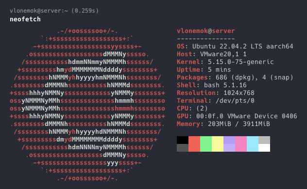
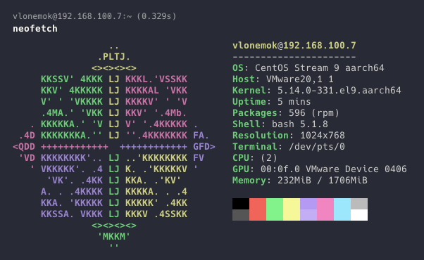

# Homework 1

### Развернуть две виртуальные машины (Ubuntu, CentOS)




#### 1. Произвести минимальную настройку (время, локаль, custom motd)

Для установки временной зоны на обеих виртаульных машинах используется команда:

```bash
tzselect
```

Для изменения локализации на русскую используем команды:

Ubuntu

```bash
sudo update-locale LANG=ru_RU.UTF-8
```

CentOS 9

```bash
sudo dnf install glibc-langpack-ru
```

```bash
localectl set-locale LANG=ru_RU.utf8
```
