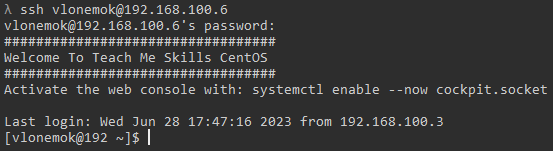
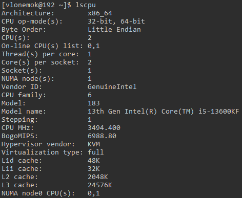
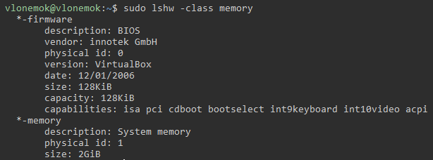
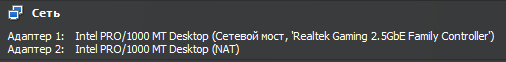
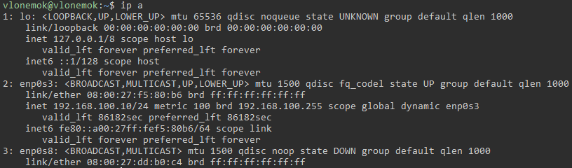
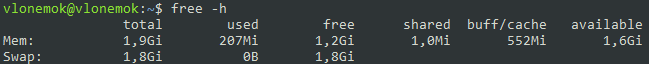
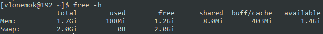
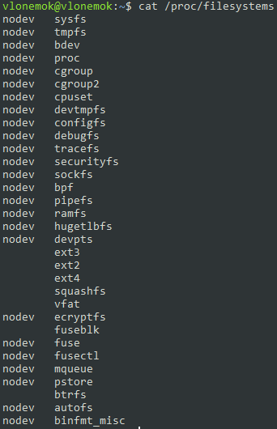
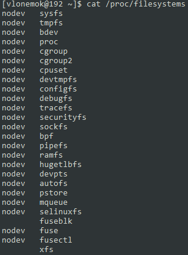

# Homework 1

## Развернуть две виртуальные машины (Ubuntu, CentOS)


### 1. Произвести минимальную настройку (время, локаль, custom motd)

Для установки временной зоны на обеих виртаульных машинах используется команда:

```bash
tzselect
```

Для изменения локализации на английскую используем команды:

Ubuntu

```bash
sudo update-locale LANG=en_US.UTF-8
```

CentOS

```bash
sudo dnf install glibc-langpack-en
localectl set-locale LANG=en_us.utf8
```

Для изменения MOTD мы должны создать или изменить существующий файл ```/etc/motd``` на желаемый нами:

CentOS:



Ubuntu:


### 2. Определить точную версию ядра

Для определения точной версии ядра используются следующая команда:

Ubuntu и CentOS

```bash
uname -r
```

### 3. Вывести список модулей ядра и записать в файл

Ubuntu и CentOS

```bash
lsmod > kernel_modules.txt
cat kernel_modules.txt
```

1 команда - запись всех модулей ядра в файл. 2 команда - проверка того, что мы записали в файл

### 4. Просмотреть информацию о процессоре и модулях оперативной памяти

Ubuntu и CentOS

Просмотреть информацию о процессоре можно используя команду ниже:

```bash
lscpu
```



Просмотреть информацию о модулях оперативной памяти можно использовав команду:

```bash
sudo lshw -class memory
```



### 5. Получить информацию о жестком диске

Ubuntu и CentOS

Получить информацию о жестком диске можно используя комманду:

```bash
sudo lshw -class disk -class storage
```


### 6. Добавить в виртуальную машину второй сетевой интерфейс (вывести информацию о нем в виртуалках)

Ubuntu и CentOS

Сначала необходимо добавить дополнительный сетевой адаптер используя виртуальную машину:



Затем на виртуальной машине посмотреть добавленный интерфейс (по умолчанию в VirtualBox их 2):

```bash
ip a
```



### 7. Узнать полную информацию об использованной и неиспользованной памяти

Ubuntu и CentOS

Для просмотра информации об использованной и неиспользованной памяти используется команда:

```bash
free -h
```

Флаг ```-h``` позволяет команде вывести значение в мегабайтах и гигабайтах, что легче читается. Без этого флага информация выводится в байтах

Ubuntu:



CentOS:



### 8. Создать пользователя new_admin_user, Настроить ssh доступ пользователю по ключу на VM, запретить ему авторизацию по паролю

### 9. Вывести список файловых систем, которые поддерживаются ядром

Ubuntu и CentOS:

Команда ниже выводит все поддерживаемые файловые системы, поддерживаемые ядром:

```bash
cat /proc/filesystems
```

Ubuntu:



CentOS:



### 10. Настроить образ так чтобы при разворачивании системы автоматически создавался пользователем default_admin_user с ssh доступом 

