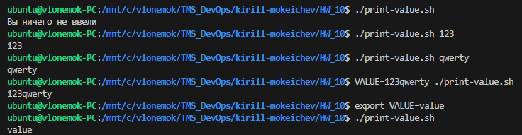
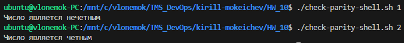
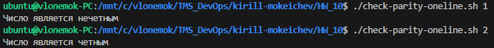
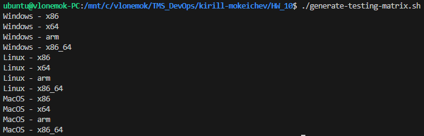

# Homework 10

## 1. Создать ```Bash``` скрипт ```print-value.sh```, выводящий значение переменной ```VALUE``` в консоль. Выполнить скрипт 3 раза, передавая каждый раз значение этой переменной разным способом

Выполнение [print-value.sh](print-value.sh):



## 2. Создать ```Shell``` скрипт ```check-parity-shell.sh```, который принимает число в качестве первого аргумента командной строки, и для чётного числа выводит в консоль строку "чётное", а для нечётного - "нечётное". В случае, если переданный аргумент не является числом, вывести соответствующее сообщение и завершить скрипт с кодом 1

Выполнение [check-parity-shell.sh](check-parity-shell.sh):



## 3. Переписать скрипт из предыдущего задания на ```Bash``` и назвать его ```check-parity-oneline.sh``` таким образом, чтобы он не использовал конструкцию ```if ... then ... else .. fi```

Выполнение [check-parity-oneline.sh](check-parity-oneline.sh):



## 4. Создать ```Bash``` скрипт ```not-empty-file.sh```, который считывает из ```STDIN``` имя файла и выводит в ```STDOUT``` его имя в случае, если он не является пустым. Проверить работу файла при помощи команды ```ls | ./not-empty-file.sh | xargs wc -l```

Выполнение [not-empty-file.sh](not-empty-file.sh):

## 5. Создать скрипт ```generate-testing-matrix.sh```, в котором объявляется 2 массива (os - массив операционных систем и arch - массив архитектур процессора) и который выводит в консоль комбинации всех возможных пар ```<OS> - <ARCH>```. Например, ```linux-x86, linux-amd64```, и т.д

Выполнение [generate-testing-matrix.sh](generate-testing-matrix.sh):



## 6. Обновить файл ```.github/workflows/validate-shell.yaml```, если он не совпадает с [данным файлом](https://github.com/tms-dos17-onl/_sandbox/blob/main/.github/workflows/validate-shell.yaml)

У меня файл совпадает

## 7. Создать ```Pull Request (PR)``` содержащий 5 созданных скриптов

## 8. (**) Убедиться, что все файлы в репозитории проходят валидацию
