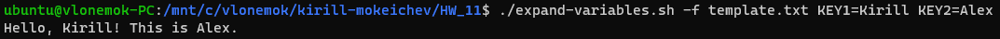

# Homework 11

## 1. Создать скрипт ```expand-variables.sh```, который считывает файл с шаблоном переданный через аргумент ```-f``` или же из стандартного потока ввода и выполняет интерполяцию переданного шаблона с использованием утилиты ```envsubst```

Описание аргументов командной строки скрипта:
```./expand-variables.sh [-f <FILE>] <KEY_VALUE_PAIR> ...```

Код скрипта [expand-variables.sh](expand-variables.sh)



## 2. Создать скрипт ```filter.sh```, который считывает файл переданный через аргумент ```-f``` или же из стандартного потока ввода и выводит в стандартный поток вывода строки содержащие токен (или любой из токенов, если их было передано несколько) по заданному правилу. Для выполнения фильтрации использовать регулярные выражения

Описание аргументов командной строки скрипта:
```./filter [-f <FILE>] {contains|startswith|endswith} <TOKEN> ...```

Код скрипта [filter.sh](filter.sh)


