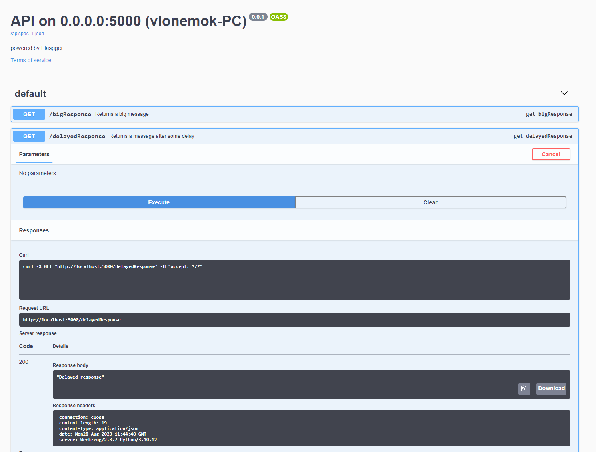

# Homework 12

## 1. Установить на VM Apache веб-сервер и настроить его на работу с PHP (например, как указано в [инструкции](https://ubuntu.com/server/docs/programming-php)). Поменять порт по умолчанию на 8080. Убедиться, что Apache работает и возвращает страницу с информацией о PHP

```bash
sudo apt update && sudo apt upgrade # Обновляем пакеты
sudo apt install apache2            # Установка Apache сервера
sudo nano /etc/apache2/ports.conf   # Здесь необходимо установить по умолчанию порт Listen 8080
sudo systemctl restart apache2      # Перезапускаем сервис apache2, чтобы применить изменения на сервере
apt install php libapache2-mod-php  # С помощью этого пакета мы подружим Apache и PHP
sudo nano /var/www/html/phpinfo.php # Здесь необходимо написать код для запуска страницы phpinfo
```

После запуска всех команд выше мы можем пройти на ```localhost:8080/phpinfo.php``` и увидеть нашу страницу


## 2. Установить на VM Nginx

```bash
sudo apt install nginx      # Установка nginx
sudo systemctl status nginx # Просмотр статуса сервиса nginx
sudo systemctl start nginx  # Необходимая команда, если сервис nginx не стартанул автоматически
```


## 3. Скопировать на VM папку <https://github.com/tms-dos17-onl/_sandbox/tree/main/lecture15/react_nginx/build> и настроить Nginx на хостинг этого веб-приложения. Проверить работоспособность приложения путем посещения всех доступных ссылок на главной странице и обновления каждой из страниц в веб-браузере

**Скопированное приложение по пути ```/var/www/homeWork12/html```**


**Создание конфига для сервера**


**Проверка всех ссылок на работоспособность**


## 4. Скопировать на VM папку <https://github.com/tms-dos17-onl/_sandbox/tree/main/lecture15/api> и запустить Python REST Api приложение согласно инструкции. Проверить работоспособность всех доступных REST Api методов с помощью Swagger

```bash
cd ~/lecture15/api              # Перейти в папку с приложением
pip install -r requirements.txt # Установка пакетов через pip
python3 main.py                 # Запуск приложения с дефолтным портом 5000
```





**Так же можно увидеть в логах самого приложения, что все методы отработали и вернули 200 код**


## 5. Настроить Nginx как Reverse Proxy для Python REST Api приложения из предыдущего пункта. А затем

- Открыть Swagger для веб-приложения через Nginx (http://<NGINX_IP>:<NGINX_PORT>/apidocs).
- Проверить работоспособность всех доступных REST Api методов через Nginx с помощью Swagger. При необходимости поправить конфигурацию Nginx сервера, чтобы все методы работали.
- Для тестирования метода /uploadFile использовать файл размером больше 1MB.
**Использовал PDF файл размером 1.5mb**


- Вывести в консоль содержимое файла конфигурации Nginx с измененными значениями и комментариями

**Настроенная конфигурация nginx**


**Все методы работают**


