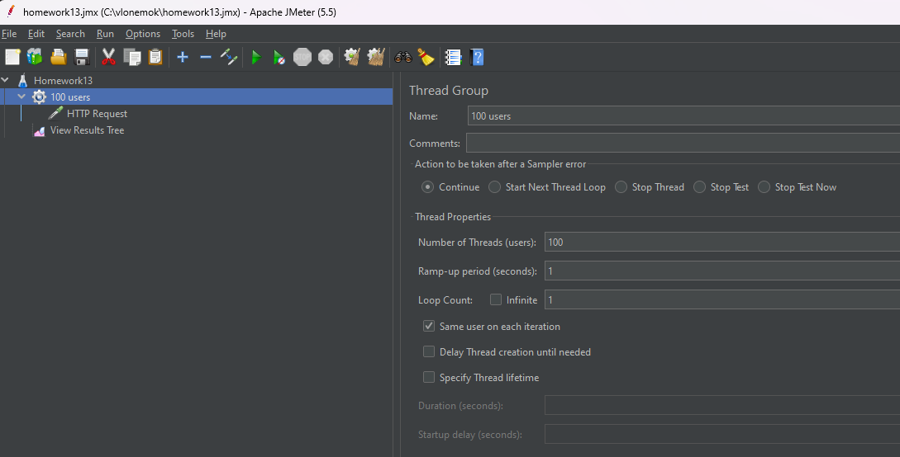
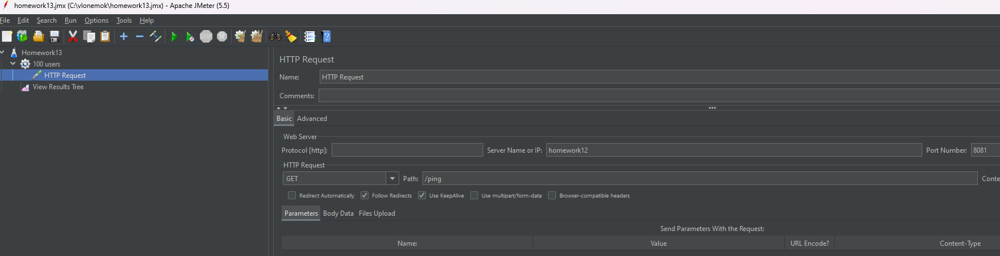
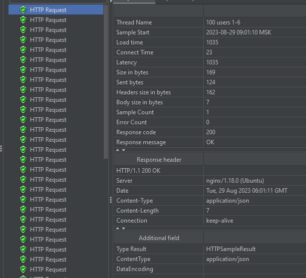
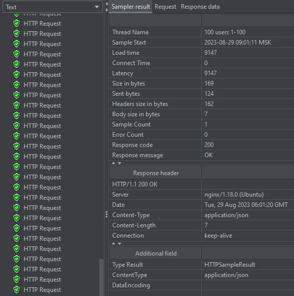
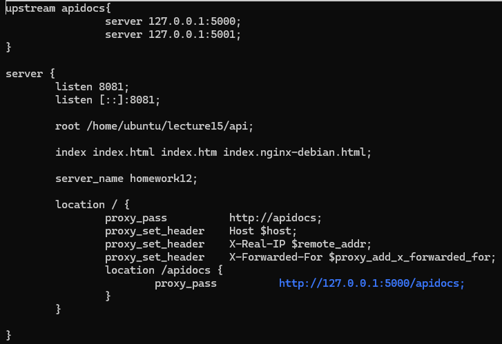
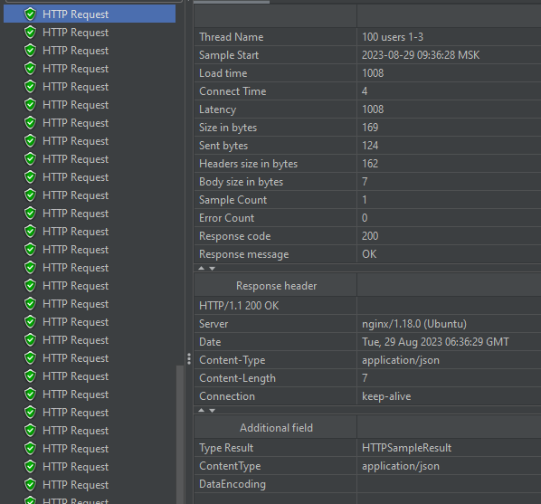
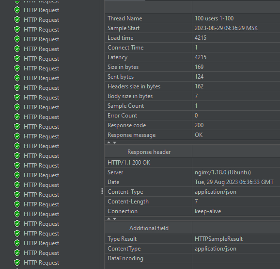

# Homework 13

## Пункты 1 и 2 в этом ДЗ как пункты 4 и 5 из предыдущей ДЗ. Там они уже описаны

## 3. Установить JMeter и написать тестовый сценарий для проверки производительности приложения путем выполнения HTTP GET запроса http://<NGINX_IP>:<NGINX_PORT>/ping от 100 пользователей





```txt
Latency на первых прогонах была в районе 1035 мс
Чем больше итераций запросов проходило, тем медленее становился отклик сервера
На последних итерациях latency была в районе 9147 мс
Сервер выдержал нагрузку в 100 юзеров
```

**Первый запрос**


**Последний запрос**


## 4. Запустить ещё один экземпляр Python REST Api приложения на другом порту

```bash
cd ~/lecture15/api
python3 main.py 5001
```

## 5. Изменить конфигурацию Nginx, чтобы он использовал в качестве бэкенда 2 приложения

```txt
Для использования nginx в качестве бэка 2 приложения используется функция upstream
```



## 6. Повторить JMeter сценарий и сравнить результаты

```txt
Прогнав нагрузочный тест в 100 пользователей на 2 приложениях можно сделать вывод, что нагрузка распределяется пополам между ними
Первый запрос составил около 1000 мс
Последний запрос составил около 4215 мс

Так же подсчитав запросы получилось, что из 100 штук - 52 пришлось на 1 приложения на порте 5000, а 48 на второе на порте 5001
```

**Первый запрос**


**Последний запрос**

