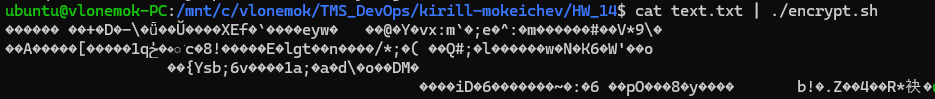

# Homework 14

## 1. Сгенерировать пару ключей/сертификатов (```private.pem``` и ```public.pem```) при помощи ```OpenSSL```

```bash
sudo apt update && sudo apt upgrade
openssl genpkey -algorithm RSA -out private.pem
openssl rsa -in private.pem -pubout -out public.pem
```

С помощью команд выше ключи мы сгенерировали ```private.pem``` и ```public.pem``` ключи


## 2. Создать скрипт ```encrypt.sh```, который считывает стандартный поток ввода, шифрует его при помощи ```public.pem``` через ```OpenSSL``` и выводит в стандартный поток вывода

Код [скрипта](encrypt.sh):



## 3. Создать скрипт ```decrypt.sh```, который считывает стандартный поток ввода, расшифровывает его при помощи ```private.pem``` через ```OpenSSL``` и выводит в стандартный поток вывода

Код [скрипта](decrypt.sh):


## 4. Сгенерировать публичный сертификат ```public-nginx.pem``` для ```private.pem``` через ```OpenSSL```, используя ```<LASTNAME>.io``` в качестве Common Name (CN)

```bash
openssl req -x509 -new -key private.pem -out public-nginx.pem -days 365
```


## 5. Настроить Nginx на работу по HTTPS, используя сертификаты из предыдущего задания. Например, чтобы Nginx возвращал домашнюю страницу по HTTPS


## 6. Настроить доверие публичному сертификату в браузере и проверить это

```
Я перепробовал все способы настройки доверия сертификату в Chrome
Не знаю почему, но у меня Chrome просто не хочет доверять сертификату
```

## 7. А теперь открыть домашнюю страницу Nginx по HTTPS через ```curl``` не прибегая к опции ```-k```


```
Смешно получилось, что настроить доверие сертификату в WSL у меня вышло, а настроить доверие в Chrome вообще не получается
```
