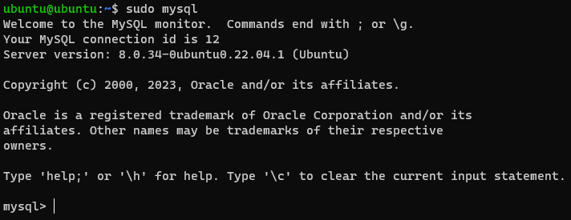
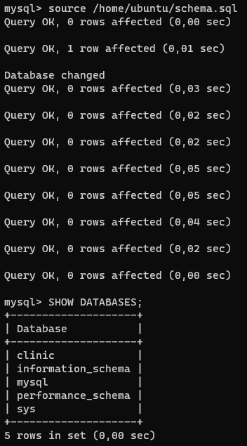
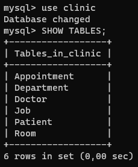
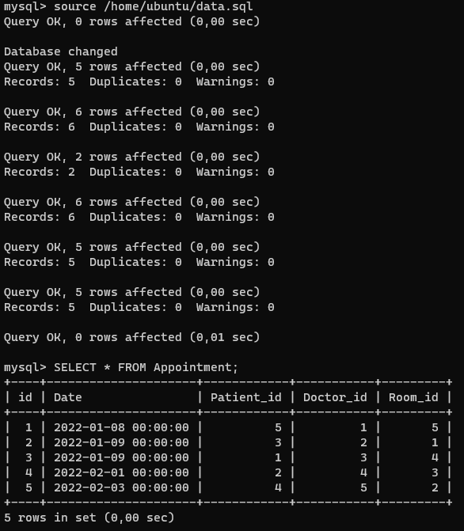
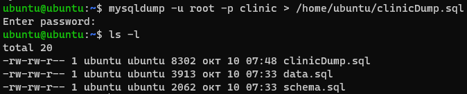
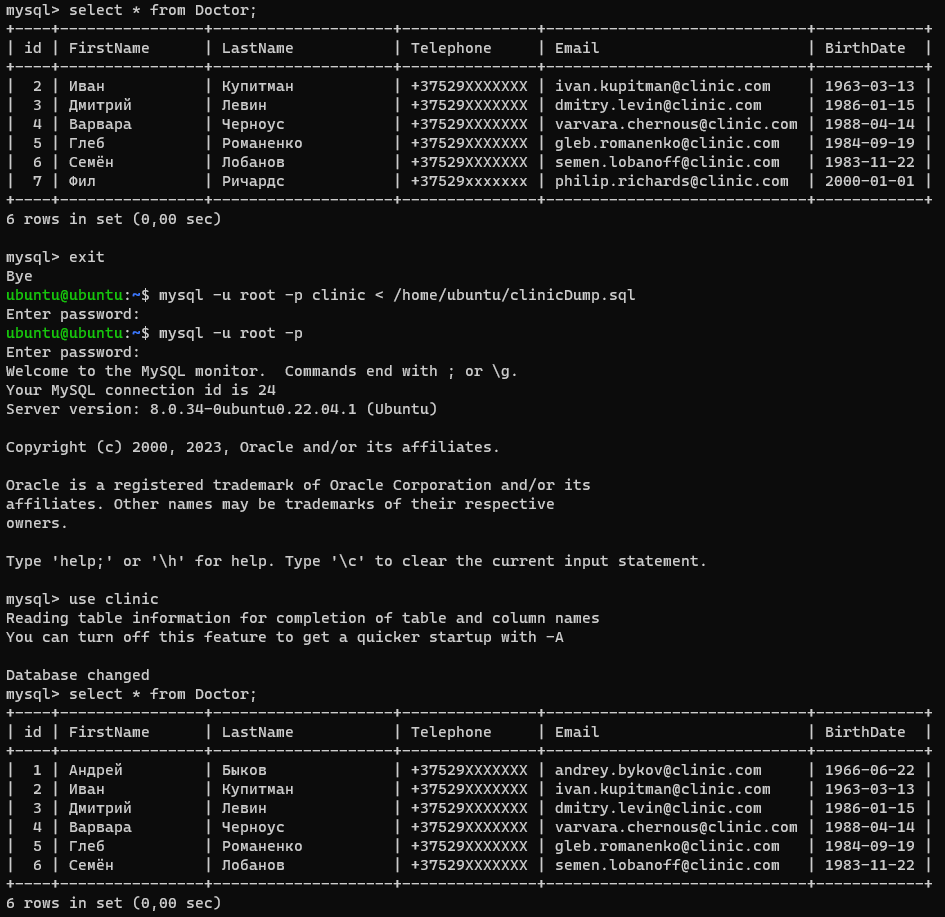

# Homework 15

## 1. Установить MySQL на VM

```bash
sudo apt update && sudo apt install mysql-server
sudo mysql_secure_installation
```



## 2. (**) Настроить Multi-Primary репликацию для MySQL на 2 VM согласно инструкции

## 3. Создать схему БД clinic и наполнить её данными используя скрипты из <https://github.com/tms-dos17-onl/_sandbox/tree/main/lecture18/mysql/initdb.d/data>

```sql
source /home/ubuntu/schema.sql
SHOW DATABASES;
use clinic
SHOW TABLES;
source /home/ubuntu/data.sql
SELECT * FROM Appointment
```







## 4. Создать бэкап базы данных clinic

```bash
mysqldump -u root -p clinic > /home/ubuntu/clinicDump.sql
```



## 5. Написать следующие SQL запросы

- Вывести всех врачей, работающих в терапевтическом отделении.

```sql
SELECT * FROM Doctor 
INNER JOIN Job ON Doctor.id = Job.Doctor_id 
INNER JOIN Department ON Job.Department_id = Department.id 
WHERE Department_id = 1;
```

- Вывести в каких отделениях побывал каждый пациент.

```sql
SELECT Patient.FirstName, Patient.LastName, Department.Name FROM Patient 
INNER JOIN Appointment ON Patient.id = Appointment.Patient_id 
INNER JOIN Room ON Appointment.Room_id = Room.id 
INNER JOIN Department ON Room.Department_id = Department.id;
```

- Обновить дату приёма для пациента Ивана Иванова на 2022-02-09.

```sql
UPDATE Appointment 
SET Appointment.Date = '2022-02-09' 
WHERE Appointment.Patient_id IN 
(SELECT Patient_id FROM Patient 
WHERE Patient.FirstName = 'Иван' AND Patient.LastName = 'Иванов');
```

- Удалить врача Андрея Быкова и все его приёмы.

```sql
DELETE Doctor, Appointment FROM Doctor, Appointment 
WHERE Doctor.id = Appointment.Doctor_id 
AND Doctor.FirstName = 'Андрей' 
AND Doctor.LastName = 'Быков';
```

- Добавить нового врача Фила Ричардса и новую пациентку Василису Васильеву и записать её к Филу Ричардсу на приём на 2022-02-14.

```sql
INSERT INTO Doctor VALUES (7, 'Фил', 'Ричардс', '+37529xxxxxxx', 'philip.richards@clinic.com', '2000-01-01');
INSERT INTO Patient VALUES (6, 'Василиса', 'Васильева', '1990-01-01', 'Тилимилитрямдия', '+37529xxxxxxx', 'vasilisa.vasileva@example.com');
INSERT INTO Appointment VALUES (6, '2022-02-14', 6, 7, 1);
```

## 6. Восстановить базу данных clinic из бэкапа и проверить, что данные соответствуют состоянию базы данных до внесенных в предыдущем задании изменений

```bash
mysql -u root -p clinic < /home/ubuntu/clinicDump.sql
```



## 7. Установить MongoDB

## 8. Создать БД clinic и наполнить её данными используя скрипты из <https://github.com/tms-dos17-onl/_sandbox/tree/main/lecture18/mongo/initdb.d>

## 9. Написать выборочно 3 запроса из задания 5 для MongoDB используя mongosh команды
