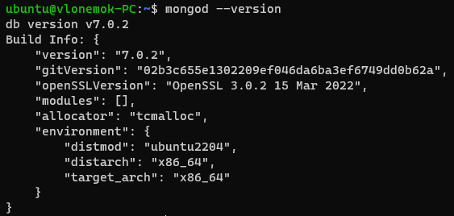
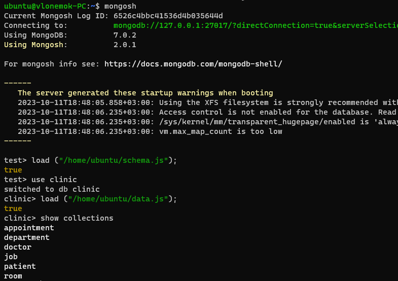

# Homework 15

## 1. Установить MySQL на VM

```bash
sudo apt update && sudo apt install mysql-server
sudo mysql_secure_installation
```


## 2. (**) Настроить Multi-Primary репликацию для MySQL на 2 VM согласно инструкции

## 3. Создать схему БД clinic и наполнить её данными используя скрипты из <https://github.com/tms-dos17-onl/_sandbox/tree/main/lecture18/mysql/initdb.d/data>

```sql
source /home/ubuntu/schema.sql
SHOW DATABASES;
use clinic
SHOW TABLES;
source /home/ubuntu/data.sql
SELECT * FROM Appointment
```


## 4. Создать бэкап базы данных clinic

```bash
mysqldump -u root -p clinic > /home/ubuntu/clinicDump.sql
```


## 5. Написать следующие SQL запросы

- Вывести всех врачей, работающих в терапевтическом отделении.

```sql
SELECT * FROM Doctor 
INNER JOIN Job ON Doctor.id = Job.Doctor_id 
INNER JOIN Department ON Job.Department_id = Department.id 
WHERE Department_id = 1;
```

- Вывести в каких отделениях побывал каждый пациент.

```sql
SELECT Patient.FirstName, Patient.LastName, Department.Name FROM Patient 
INNER JOIN Appointment ON Patient.id = Appointment.Patient_id 
INNER JOIN Room ON Appointment.Room_id = Room.id 
INNER JOIN Department ON Room.Department_id = Department.id;
```

- Обновить дату приёма для пациента Ивана Иванова на 2022-02-09.

```sql
UPDATE Appointment 
SET Appointment.Date = '2022-02-09' 
WHERE Appointment.Patient_id IN 
(SELECT Patient_id FROM Patient 
WHERE Patient.FirstName = 'Иван' AND Patient.LastName = 'Иванов');
```

- Удалить врача Андрея Быкова и все его приёмы.

```sql
DELETE Doctor, Appointment FROM Doctor, Appointment 
WHERE Doctor.id = Appointment.Doctor_id 
AND Doctor.FirstName = 'Андрей' 
AND Doctor.LastName = 'Быков';
```

- Добавить нового врача Фила Ричардса и новую пациентку Василису Васильеву и записать её к Филу Ричардсу на приём на 2022-02-14.

```sql
INSERT INTO Doctor VALUES (7, 'Фил', 'Ричардс', '+37529xxxxxxx', 'philip.richards@clinic.com', '2000-01-01');
INSERT INTO Patient VALUES (6, 'Василиса', 'Васильева', '1990-01-01', 'Тилимилитрямдия', '+37529xxxxxxx', 'vasilisa.vasileva@example.com');
INSERT INTO Appointment VALUES (6, '2022-02-14', 6, 7, 1);
```

## 6. Восстановить базу данных clinic из бэкапа и проверить, что данные соответствуют состоянию базы данных до внесенных в предыдущем задании изменений

```bash
mysql -u root -p clinic < /home/ubuntu/clinicDump.sql
```


## 7. Установить MongoDB

```bash
curl -fsSL https://pgp.mongodb.com/server-7.0.asc | \
   sudo gpg -o /usr/share/keyrings/mongodb-server-7.0.gpg \
   --dearmor

echo "deb [ arch=amd64,arm64 signed-by=/usr/share/keyrings/mongodb-server-7.0.gpg ] https://repo.mongodb.org/apt/ubuntu jammy/mongodb-org/7.0 multiverse" | sudo tee /etc/apt/sources.list.d/mongodb-org-7.0.list

sudo apt-get update
sudo apt-get install -y mongodb-org
```



## 8. Создать БД clinic и наполнить её данными используя скрипты из <https://github.com/tms-dos17-onl/_sandbox/tree/main/lecture18/mongo/initdb.d>

```bash
mongosh
```

```js
load ("/home/ubuntu/schema.js")
use clinic
load ("/home/ubuntu/data.js")
```



## 9. Написать выборочно 3 запроса из задания 5 для MongoDB используя mongosh команды

- Удалить врача Андрея Быкова и все его приёмы.

```js
clinic> db.doctor.findOneAndDelete({ "LastName": "Быков", "FirstName": "Андрей" })
{
  _id: ObjectId("6526c4f8c41536d4b0356453"),
  id: 1,
  Email: 'andrey.bykov@clinic.com',
  LastName: 'Быков',
  BirthDate: '1966-06-22',
  FirstName: 'Андрей',
  Telephone: '+37529XXXXXXX'
}

clinic> db.appointment.deleteMany({"Doctor_id": 1})
{ acknowledged: true, deletedCount: 1 }
```

- Обновить дату приёма для пациента Ивана Иванова на 2022-02-09.

```js
clinic> db.patient.findOne({"FirstName": "Иван", "LastName": "Иванов"})
{
  _id: ObjectId("6526c4f8c41536d4b035644e"),
  id: 1,
  Email: 'ivan.ivanov@example.com',
  Address: 'Тилимилитрямдия',
  LastName: 'Иванов',
  BirthDate: '1991-01-01',
  FirstName: 'Иван',
  Telephone: '+37517XXXXXXX'
}

clinic> db.appointment.updateOne({"Patient_id": 1}, {$set: {Date : "2022-02-09 00:00:00.000000"}})
{
  acknowledged: true,
  insertedId: null,
  matchedCount: 1,
  modifiedCount: 1,
  upsertedCount: 0
}
```

- Добавить нового врача Фила Ричардса и новую пациентку Василису Васильеву и записать её к Филу Ричардсу на приём на 2022-02-14.

```js
clinic> db.doctor.insertOne({"id": 7, "Email": "philip.richards@clinic.com", "LastName": "Ричардс", "BirthDate": "2000-01-01", "FirstName": "Фил", "Telephone": "+37529xxxxxxx"})
{
  acknowledged: true,
  insertedId: ObjectId("6526cb02c41536d4b035646b")
}

clinic> db.patient.insertOne({"id": 6, "Email": "vasilisa.vasileva@example.com", "Address": "Тилимилитрямдия", "LastName": "Васильева", "BirthDate": "1990-01-01", "FirstName": "Василиса", "Telephone": "+37529xxxxxxx"})
{
  acknowledged: true,
  insertedId: ObjectId("6526cb91c41536d4b035646c")
}

clinic> db.appointment.insertOne({ "id": 6, "Date": "2022-03-14 00:00:00.000000", "Room_id": 6, "Doctor_id": 7, "Patient_id": 6 })
{
  acknowledged: true,
  insertedId: ObjectId("6526cc21c41536d4b035646d")
}
```
