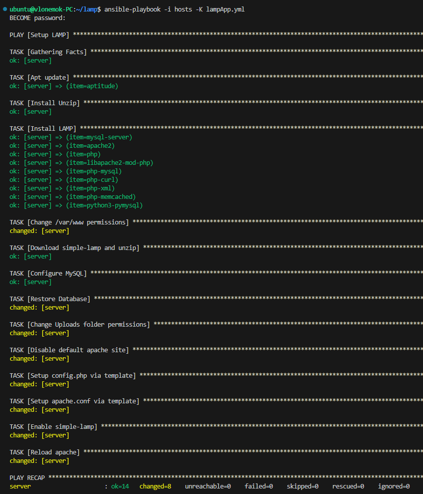
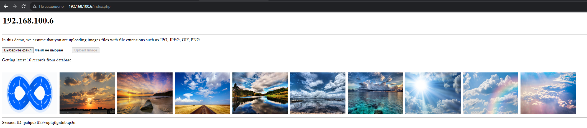

# Homework 16

## 1. Устанавливает LAMP стэк на VM

Здесь находится описание первого задания
[task1/README.md](task1/README.md)

## 2. (**) Устанавливает memcached сервис на VM

## 3. Скачивает приложение <https://github.com/qyjohn/simple-lamp> как архив с GitHub и устанавливает его

**Скриншот работы [плейбука](task3-4/lampApp.yml)**

**Ниже скришот работы приложения**

## 4. Устанавливает правильные параметры в конфиге приложения config.php. Рекомендуется использовать [подход с Jinja шаблонами](https://www.digitalocean.com/community/tutorials/how-to-create-and-use-templates-in-ansible-playbooks)

Все **Jinja** шаблоны находятся [тут](/HW_16/task3-4/templates/)

## 5. Создать Pull Request (PR) содержащий 1 Ansible playbook

**Pull Request не сделал, потому что изначально делал все в ветке main, начал делать все прежде, чем прочитал 5 задание**
