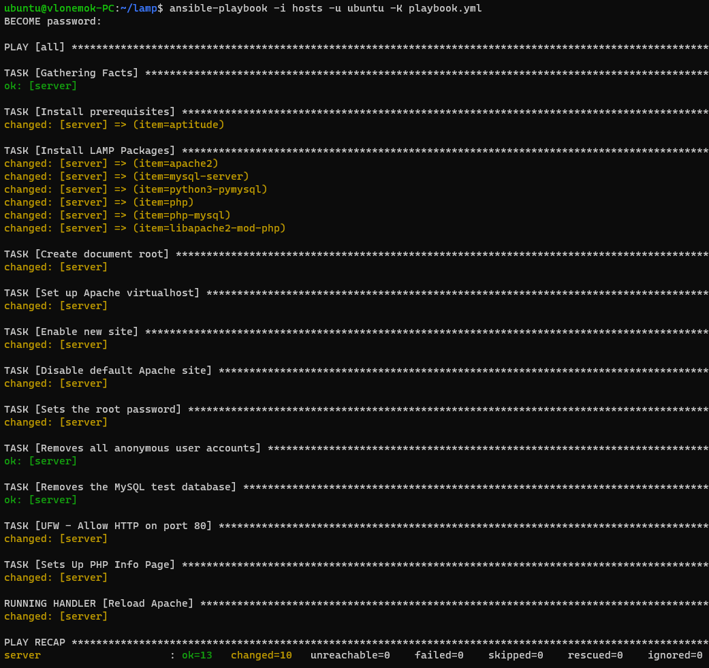
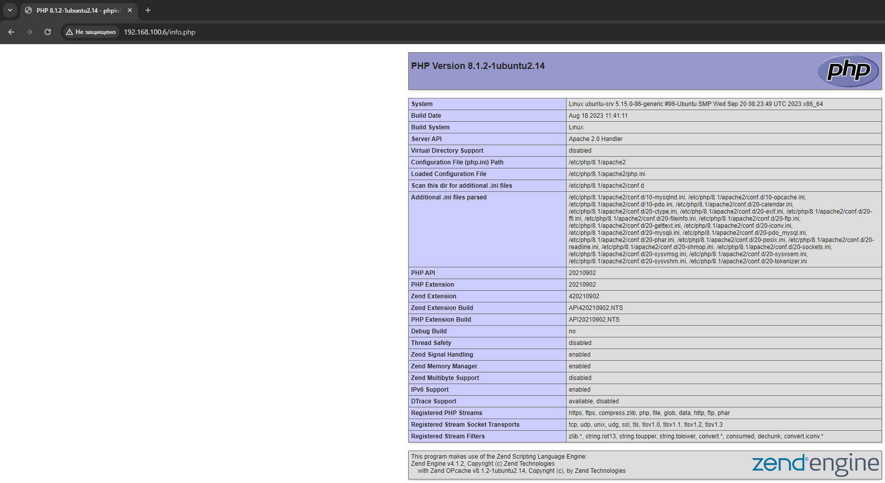

# 1. Устанавливает LAMP стэк на VM

Здесь находится [playbook](playbook.yml), который устанавливает LAMP стэк на VM.
В моем случае VM локальная на VirtualBox, Ansible установлен на WSL
В [vars/default.yml](vars/default.yml) находятся переменные, необходимыми для настройки MySQL и PHP
Файлы [files/apache.conf.j2](files/apache.conf.j2) и [files/info.php.j2](files/info.php.j2) служат шаблонами Jinja для более удобной подстановки на виртуальную машину для изменения конфигураций Apache и PHP

Скриншот отработки всех задач Ansible:

Скриншот работы info.php после настройки сервера плейбуком:

