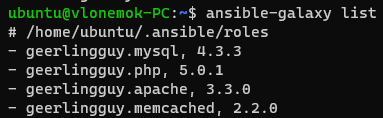
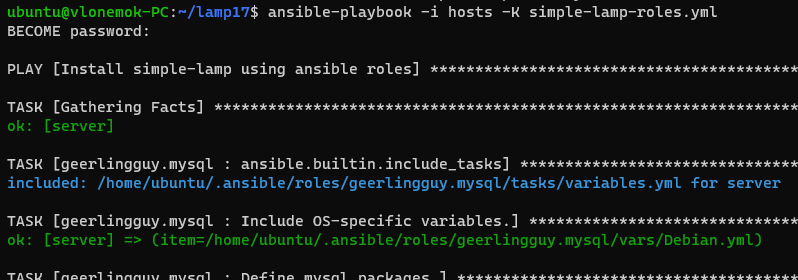
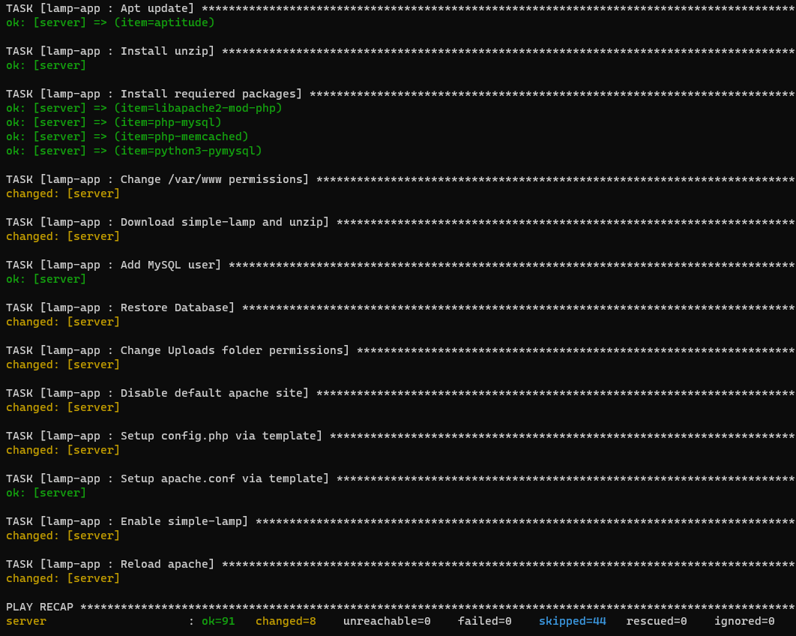
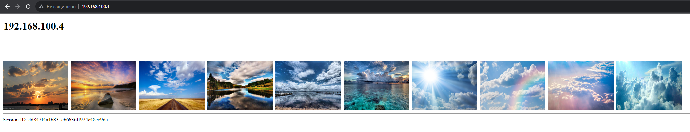

# Homework 17

## Реализовать Ansible playbook, который

### 1. Устанавливает LAMP стэк на VM при помощи ролей

- [Apache](https://galaxy.ansible.com/ui/standalone/roles/geerlingguy/apache/)
- [MySQL](https://galaxy.ansible.com/ui/standalone/roles/geerlingguy/mysql/)
- [PHP](https://galaxy.ansible.com/ui/standalone/roles/geerlingguy/php/)

```bash
ansible-galaxy install geerlingguy.apache geerlingguy.mysql geerlingguy.php geerlingguy.memcached
ansible-galaxy list
```



### 2. (**) Устанавливает memcached сервис на VM при помощи [роли](https://galaxy.ansible.com/ui/standalone/roles/geerlingguy/memcached/)

### 3. Перенести логику по установке приложения [https://github.com/qyjohn/simple-lamp](simple-lamp) в Ansible роль

```bash
ansible-playbook -i hosts -K simple-lamp-roles.yml
```







### 4. Создать Pull Request (PR) содержащий Ansible playbook и разработанную роль/роли
