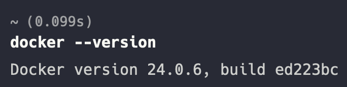
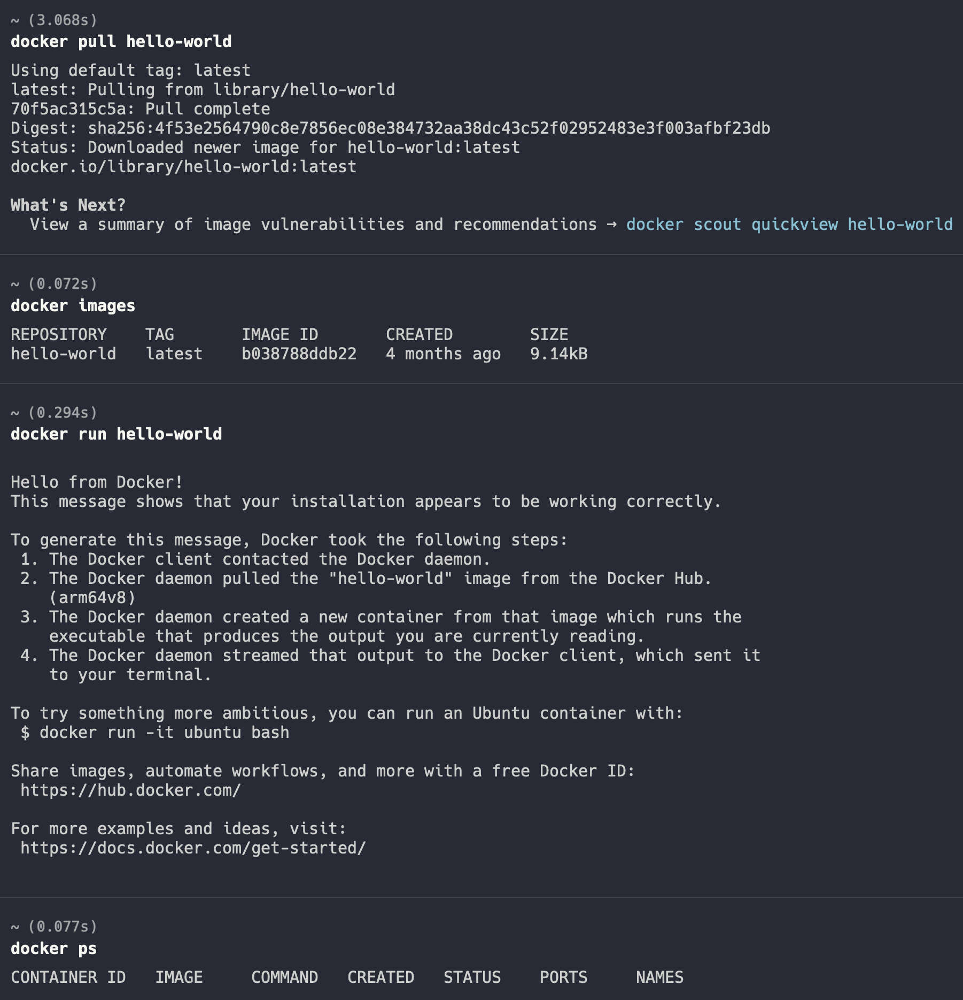
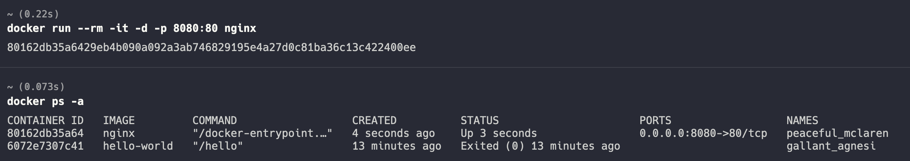
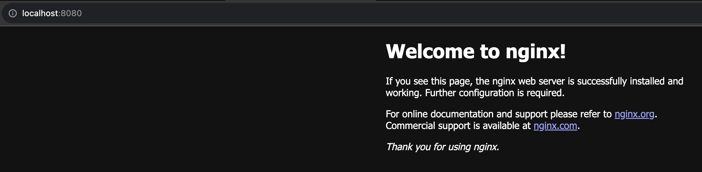
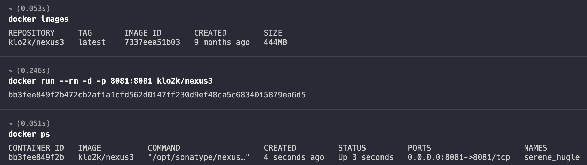
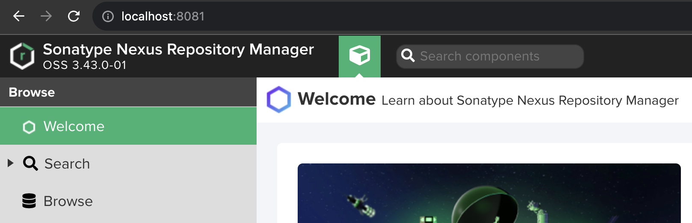
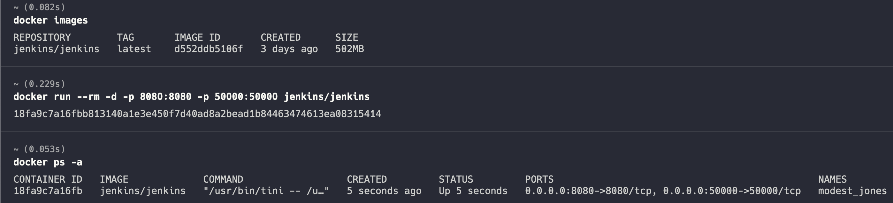
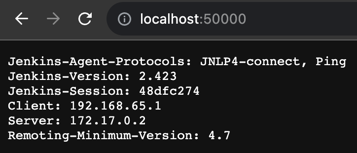

# Homework 18

## 1. Установить Docker на хостовую ОС. В случае с Windows использовать WSL backend

## 2. Убедиться, что Docker работает исправно путем запуска контейнера hello-world

## 3. Установить Nginx используя Docker образ

## 4. Изучить следующие команды и их флаги

- docker run (-i, -t, -d, --rm)
    -i - окрывает поток STDIN
    -t - я нашел что-то про всевдо TTY, но не понял о чем это. Используется обычно с -i для ввода комманд
    -d - запускает docker daemon, то есть запускает контейнер в фоне
    --rm - после использования контейнера останавливает и удаляет его
- docker ps (-a, -l, -q)
    -a - выводит все контейнеры. Запущенные, остановленные
    -l - выводит информацию о последнем контейнере
    -q - показывает только ID контейнеров
- docker images
    выводит список всех изображений скачанных локально
- docker start/docker stop/docker restart
    docker start - запускает контейнер, который ранее "спал" - был остановлен
    docker stop - останавливает работающий контейнер
    docker restart - перезапускает контейнер
- docker exec
    запускает определенную комманду в запущенном контейнере 

## 5. Установить Nexus используя Docker образ

## 6. Установить Jenkins используя Docker образ

