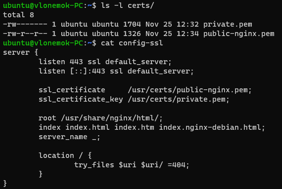
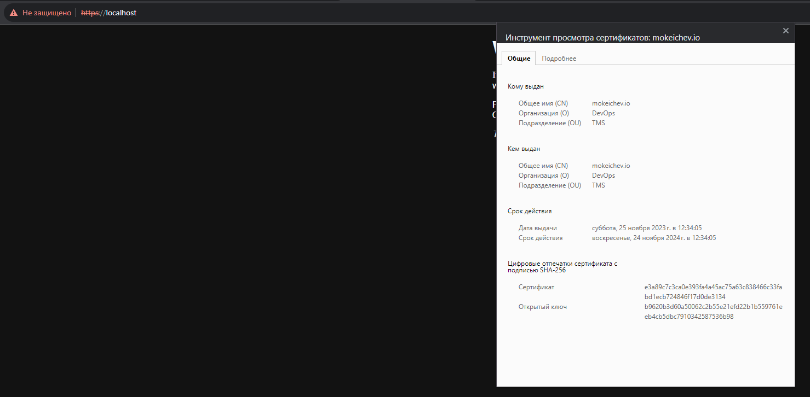
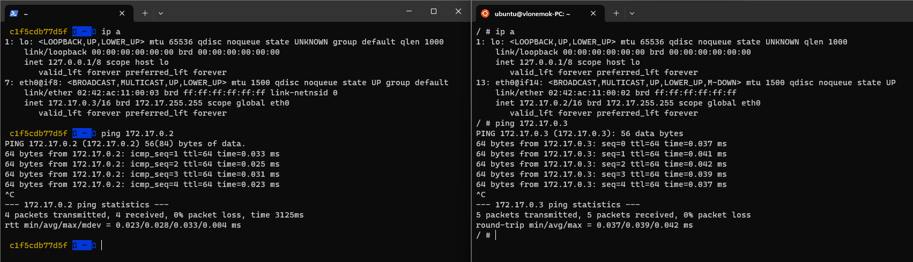
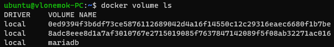
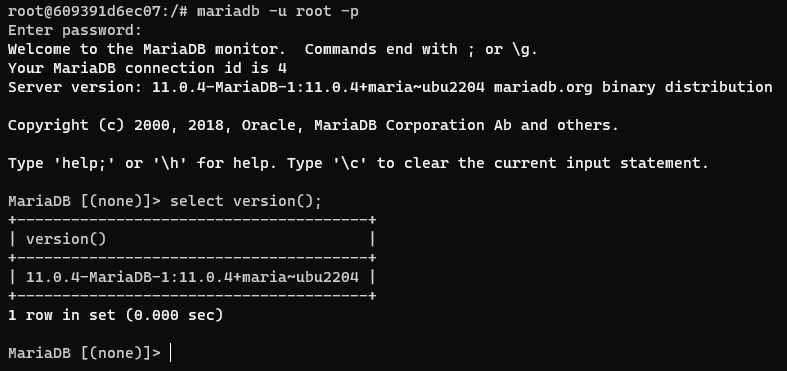
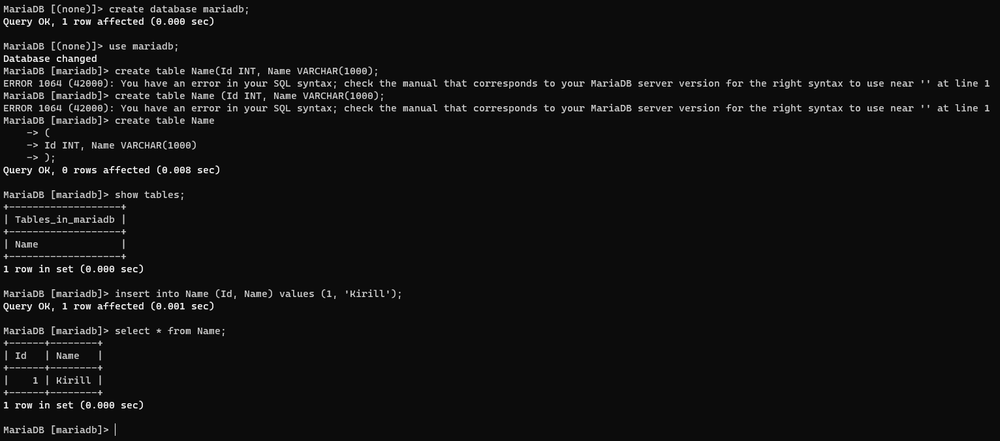
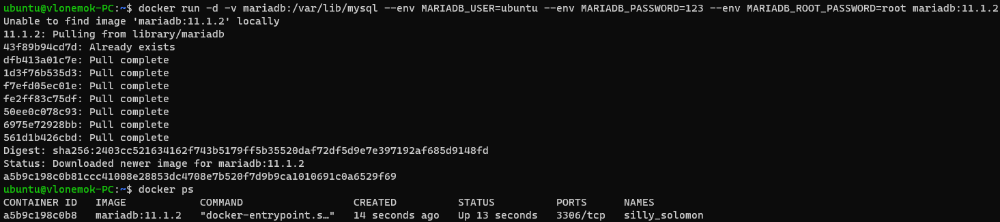
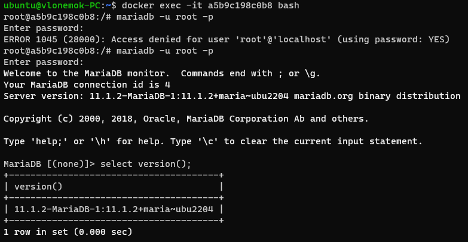
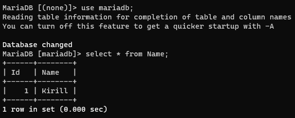

# Homework 19

## 1. Установить Nginx и смонтировать в него

- конфигурационный файл с хоста, который выполняет настройку HTTPS для страницы по умолчанию
- директорию с сертификатами

```bash
docker run --rm -it -p 443:443 -v /home/ubuntu/config-ssl:/etc/nginx/conf.d/default.conf:ro -v /home/ubuntu/certs:/etc/nginx/certs nginx
```





```text
У меня как и в 14 домашке браузер не хочет доверять сертификату, хотя я его добавил. 
```

## 2. Запустить 2 Docker контейнера (например, Docker Getting Started и netshoot) с настройками сети по умолчанию и проверить есть ли между ними соединение

```bash
docker run --rm -it nicolaka/netshoot
docker run --rm -it docker/welcome-to-docker
```



## 3. Создать именованный Docker volume, который будет использоваться для хранения данных MariaDB. Установить MariaDB версии 11.0 используя ранее созданный volume. Затем

```bash
docker volume create mariadb
docker volume ls
```



```bash
docker run -d -v mariadb:/var/lib/mysql --env MARIADB_USER=ubuntu --env MARIADB_PASSWORD=123 --env MARIADB_ROOT_PASSWORD=root mariadb:11.0
```

- Запустить интерактивную сессию Bash в запущенном контейнере при помощи docker exec

```bash
docker exec -it 609391d6ec07 bash
```

- Проверить версию MariaDB через SQL запрос

```sql
select version();
```



- Создать БД, таблицу и запись

```sql
create database mariadb;
use mariadb;
create table Name(Id INT, Name VARCHAR(1000));
insert into Name (Id, Name) values (1, 'Kirill');
select * from Name;
```



- Выполнить апгрейд MariaDB путем подмены версии используемого Docker образа на 11.1.2

```bash
docker stop <container_id>
docker rm <container_id>
docker run -d -v mariadb:/var/lib/mysql --env MARIADB_USER=ubuntu --env MARIADB_PASSWORD=123 --env MARIADB_ROOT_PASSWORD=root mariadb:11.1.2
```



- Проверить, что версия MariaDB поменялась

```bash
docker exec -it a5b9c198c0b8 bash
```

```sql
 select version();
```



- Проверить, что данные остались

```sql
use mariadb;
select * from Name;
```


