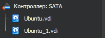
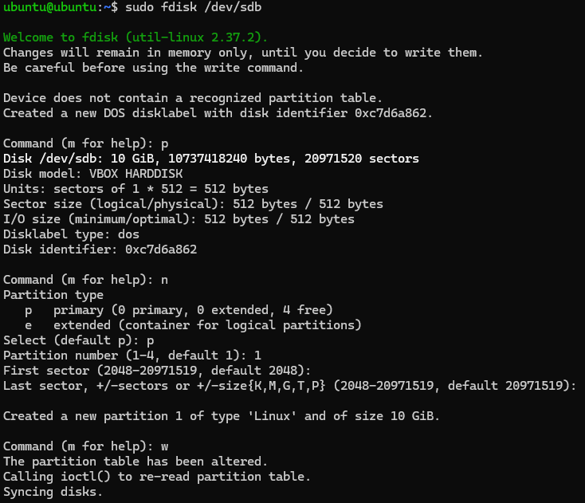
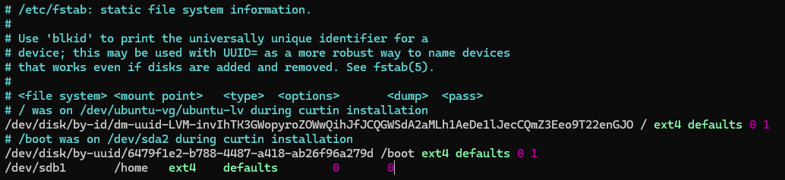
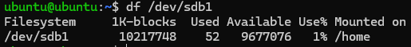
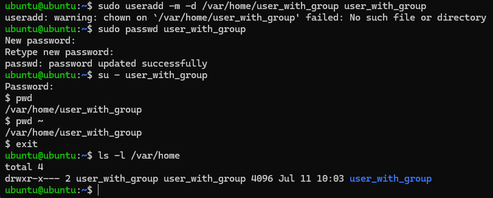
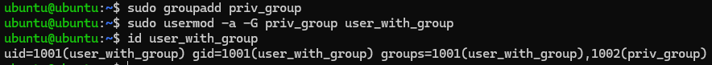
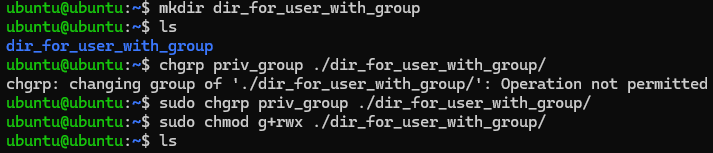

# HomeWork 2

## 1. Смонтировать /home на отдельный раздел:

Для начала необходимо добавить новый диск в virtualBox:



После мы должны убедиться в том, что мы добавили новый диск используя команду:

```bash
sudo fdisk -l
```

Далее используя команду ```sudo fdisk /dev/sdb``` мы создаем новый раздел нашего диска.



После используем команды для создания файловой системы на новом разделе и монтирования этой файловой системы:

```bash
sudo mkfs -t ext4 /dev/sdb1
sudo mount /dev/sdb1 /mnt
```

Далее копируем домашнюю директорию на новый раздел:

```bash
sudo cp -rp /home/* /mnt
```

Последний шаг - изменение fstab

```bash
sudo vim /etc/fstab
```



Далее ```sudo systemctl reboot``` для принятия всех изменений в системе

Проверка того, что ```/home``` на новом разделе:

```bash
df /dev/sdb1
```



## Создать нового пользователя user_with_group с home-директорией /var/home/user:



## 3. Создать новую группу пользователей priv_group, перенести в нее пользователя user_with_group



## 4. Cоздать директорию и выдать права на нее только группе этого пользователя



## 5. Установить ntpd(chrony), разрешить пользователю user_with_group выполнять команду 

Устанавливаем ```chrony``` используя команду:

```bash
sudo apt update && sudo apt install chrony
```

Далее даем доступ пользователю ```user_with_group``` к выполнению команды ```sudo systemctl restart chrony```:

```bash
sudo visudo
```


После проверяем возможность использовать эту команду пользователем user_with_group:


