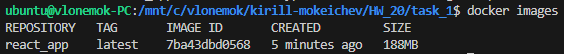
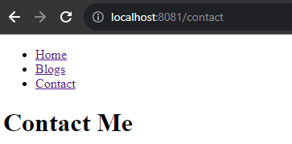
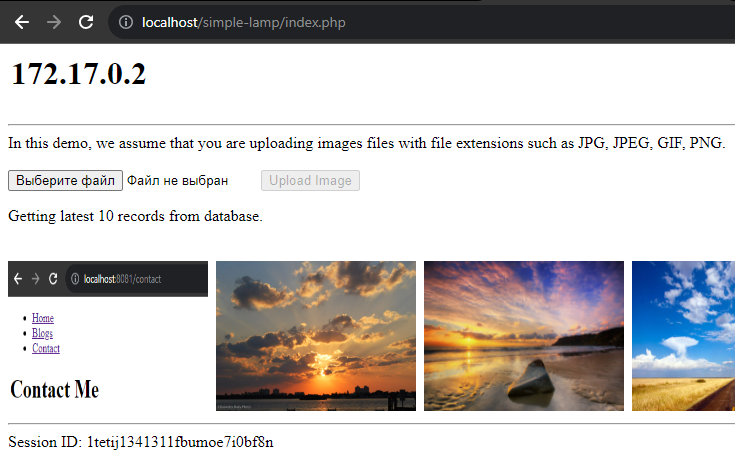

# Homework 20

## 1. Написать Dockerfile для [React приложения](https://github.com/tms-dos17-onl/_sandbox/tree/main/lecture15/react_nginx). Можно сгенерировать ресурсы для веб-сайта (HTML/CSS/JS файлы) прямо из исходников, а можно уже взять готовые из папки [build](https://github.com/tms-dos17-onl/_sandbox/tree/main/lecture15/react_nginx/build). Собрать образ, запустить и проверить работоспособность приложения в контейнере

[Dockerfile 1 задания](/HW_20/task_1/Dockerfile)

```bash
docker build -t react_app .
docker run -d -p 8081:80 react_app
```





## 2. Написать Dockerfile для [LAMP приложения](https://github.com/qyjohn/simple-lamp), который устанавливает весь LAMP стек в один образ. Подсказка: для того, чтобы в Docker контейнере запускались службы, нужно установить systemd и задать его как ENTRYPOINT, а также запускать контейнер в привилегированном режиме. Например, как [тут](https://github.com/tms-dos17-onl/_sandbox/blob/main/lecture20/simple-lamp/Dockerfile)

[Dockerfile 2 задания](/HW_20/task_2/Dockerfile)

```bash
docker build -t lamp-app .
docker run --privileged -d -p 80:80 lamp-app
```



## 3. Написать Dockerfile для [LAMP приложения](https://github.com/qyjohn/simple-lamp), который устанавливает только само приложение в Apache используя php:apache Docker образ. Написать docker-compose.yaml, который разворачивает зависимости приложения (MySQL и Memcached) и запускает само приложение. Обратить внимание на /docker-entrypoint-initdb.d mount для MySQL, использование которого описано в документации к MySQL Docker образу. Посмотреть, что такое [wait-for-it.sh](https://github.com/vishnubob/wait-for-it) и придумать, как его можно заиспользовать в этом задании

## 4. (**) Запустить [Java приложение](https://github.com/LorenzoBettini/docker-compose-java-example) с помощью docker-compose.yml, находящемся в репозитории

## 5. (**) Написать Ansible playbook, который будет устанавливать Docker и Docker Compose на целевую VM с помощью [роли](https://galaxy.ansible.com/ui/standalone/roles/geerlingguy/docker/), а затем будет запускать одно из следующих приложений с помощью [Docker Compose](https://stackoverflow.com/questions/62452039/how-to-run-docker-compose-commands-with-ansible)

- [LAMP приложение](https://github.com/qyjohn/simple-lamp)
- [Java приложение](https://github.com/LorenzoBettini/docker-compose-java-example)
- [Nginx/PHP/MySQL приложение](https://github.com/nanoninja/docker-nginx-php-mysql/tree/master)

Продумать какие переменные будут доступны для пользователя Ansible playbook и каким образом они будут встраиваться в ```docker-compose.yml```.

## 6. (**) В качестве эксперимента, установить некоторую зависимость приложения (например, БД) из предыдущего пункта как сервис на VM при помощи Ansible роли. Само приложение оставить в Docker и настроить на работу с зависимостью на VM
