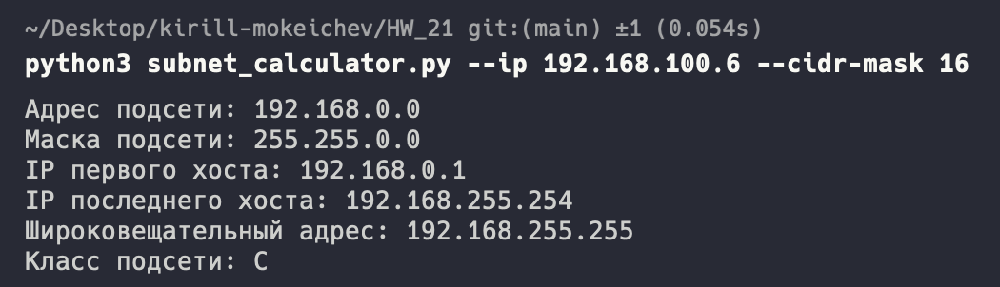

# Homework 21

## 1. Реализовать калькулятор подсетей subnet_calculator.py ([наподобие](https://www.calculator.net/ip-subnet-calculator.html)), который принимает IP адрес и маску в формате CIDR (например, /27) как аргументы командной строки и выводит в консоль

- адрес подсети
- маску подсети
- IP адреса первого и последнего хостов
- широковещательный адрес
- класс подсети

Описание аргументов командной строки скрипта:

```./subnet_calculator.py --ip <ID_ADDRESS> --cidr-mask <CIDR_MASK>```

[Код калькулятора подсетей](subnet_calculator.py)


