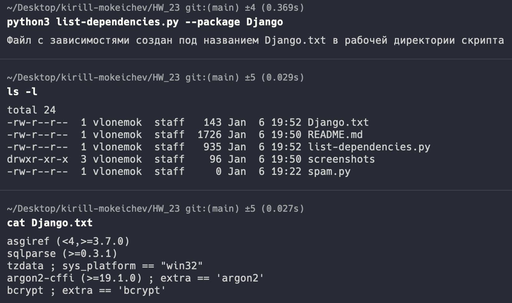

# Homework 23

## 1. Реализовать скрипт, который генерирует файл с зависимостями для указанного pip пакета. Для этого необходимо выполнить [HTTP запрос](https://warehouse.pypa.io/api-reference/json.html#get--pypi--project_name--json) и достать значение аттрибута ```requires_dist```

Для реализации скрипта рекомендуется использовать следующие пакеты/модули:

- [requests](https://pypi.org/project/requests/)

Описание аргументов командной строки скрипта:

```./list-dependencies.py --package <PACKAGE>```

[Код скрипта генерирующего зависимости](list-dependencies.py)



## 2. Реализовать скрипт ```spam.py```, который отправляет e-mail от ```--from``` по указанному адресу ```--to```. Логин для соединения с SMTP сервером должен запрашиваться интерактивно при помощи ```input()```, а пароль - при помощи модуля ```getpass```

Для реализации скрипта рекомендуется использовать следующие пакеты/модули:

- [email](https://docs.python.org/3/library/email.examples.html)
- [getpass](https://docs.python.org/3/library/getpass.html)
- [smtplib](https://docs.python.org/3/library/smtplib.html)

Описание аргументов командной строки скрипта:

```./spam.py --from <FROM> --to <TO>```
