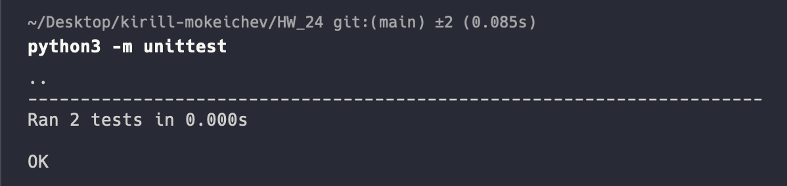

# Homework 24

## 1. Selenium тесты не получилось запустить на MacOS, обсуждали на созвоне

## 2. Написать тест с использованием модуля unittest для любого задания из домашек по Python

[Код тестов для subnet_calculator](test_subnet_calculator.py)

