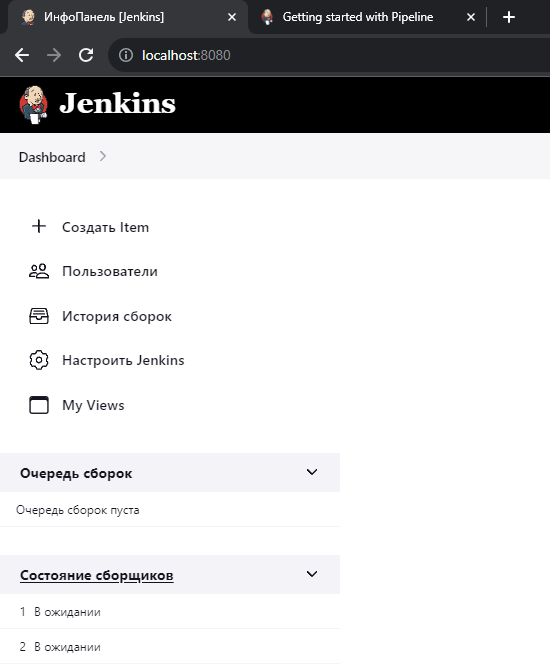
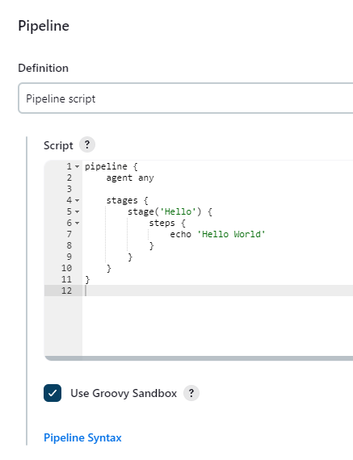
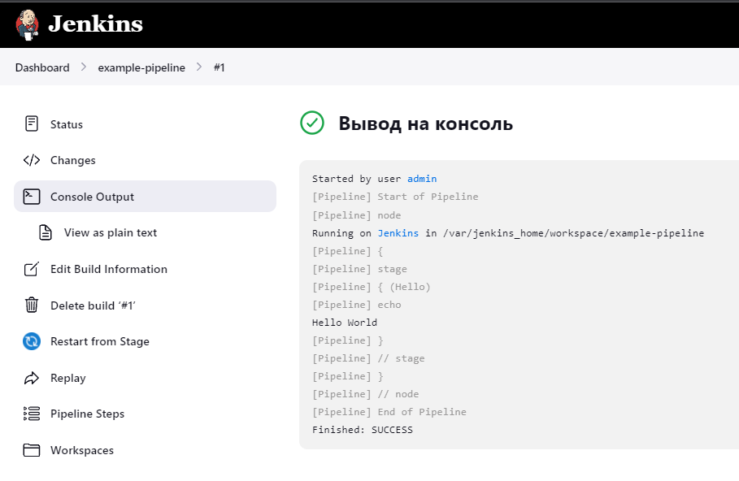

# Homework 25

## 1. Прочитать [статью](https://martinfowler.com/articles/continuousIntegration.html)

## 2. Установить Jenkins

## 3. Создать свой первый pipeline по [инструкции "Through the classic UI"](https://www.jenkins.io/doc/book/pipeline/getting-started/#through-the-classic-ui)

