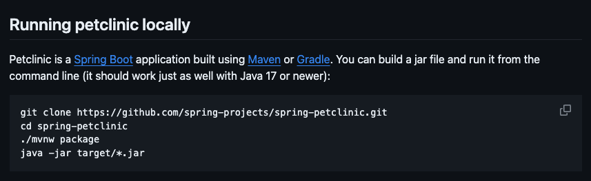
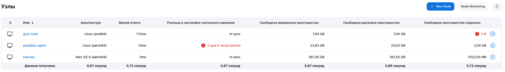
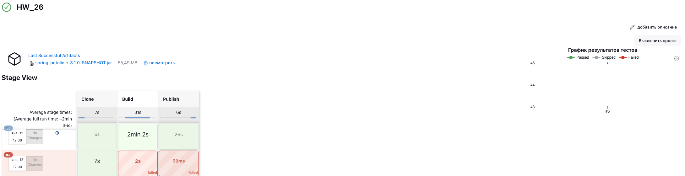
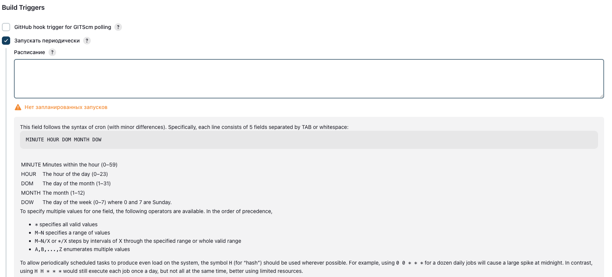

# Homework 26

## 1. Познакомиться с описанием проекта [spring-petclinic](https://github.com/tms-dos17-onl/spring-petclinic), изучить какие инструменты нужны для его сборки



```text
Исходя из описания проекта понятно, что для сборки проекта можно использовать Maven или Gradle
```

## 2. Создать статический Jenkins агент (можно использовать WSL), установить туда инструменты, необходимые для сборки проекта

```text
Подключил 2 ноды, одна GCP Compute Engine, другая Parallels-Desktop
Для работы pipeline использовал GCP Compute Engine
Parallels-Desktop подключил просто для проверки
```



```bash
sudo apt update
sudo apt install git
sudo apt install openjdk-17-jre-headless
sudo apt install maven
sudo apt install gradle
```

## 3. Реализовать Jenkinsfile для проекта, который состоит из следующих этапов (stages)

- Clone
- Клонируется данный проект. Обратите внимание, что этот репозиторий приватный и для того, чтобы его склонировать нужно использовать какие-то credentials. Необходимо создать нужные credentials в Jenkins и сослаться на них при написании pipeline.
- Build
- Происходит сборка проекта через Maven или Gradle и запускаются юнит-тесты.
- Publish
- Публикуется артефакт сборки с помощью инструкции archiveArtifacts.
- Публикуется отчёт тестирования с помощью инструкции junit.

[Код Jenkinsfile](Jenkinsfile)



## 4. Настроить сборку по расписанию (каждый час) при помощи блока triggers в Jenkinsfile

```text
Добавить сборку по расписанию можно добавив в Jenkinsfile пункт:
```

```jenkins
triggers {
    cron "0 * * * *"
}
```

```text
Так же можно настроить периодический запуск в настройках pipeline
```



## 5. (**) Реализовать Dockerfile для данного проекта и изменить стадию Build таким образом, чтобы она строила Docker образ. Стадию Publish в данном случае можно пропустить
