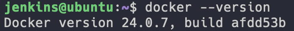
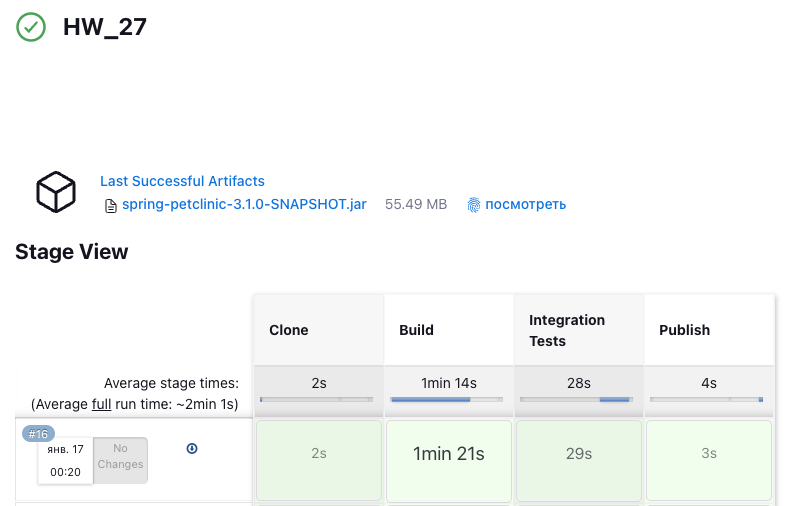
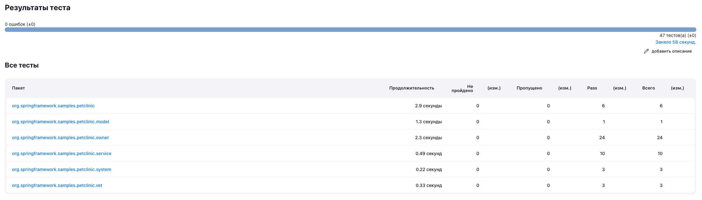

# Homework 27

## 1. Создать новый Jenkins агент и установить на нём Docker



## 2. Изменить Jenkinsfile из предыдущего домашнего задания путём добавления стадии ```"Integration Tests"``` между стадиями ```Build``` и ```Publish```. Она должна запускаться в Docker контейнере на созданном ранее Jenkins агенте при помощи [Docker Pipeline плагина](https://www.jenkins.io/doc/book/pipeline/docker/) и выполнять следующие шаги

- Запуск приложения в фоновом режиме.
- Проверка работоспособности приложения при помощи ```curl```.
- Для передачи артефактов между агентами использовать ```stash/unstash```.

[Jenkinsfile с вышеперечисленными условиями](Jenkinsfile)

[Вывод в консоль отработавшего пайплайна](consoleText.txt)




