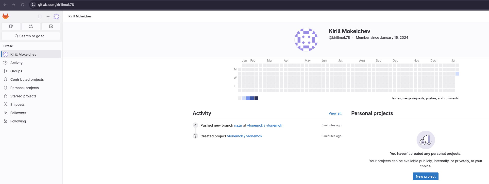
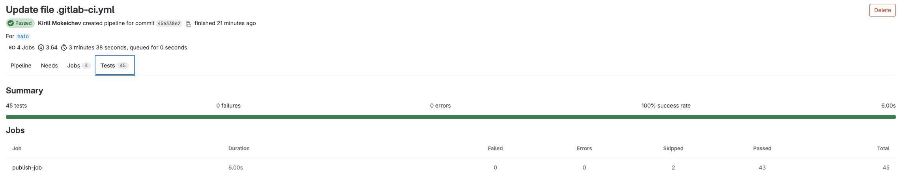
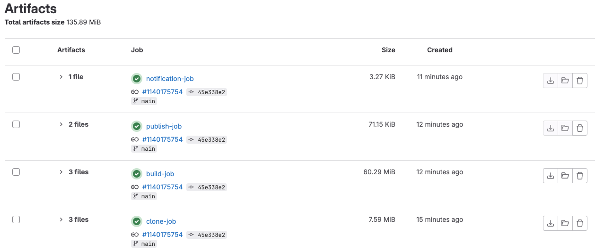
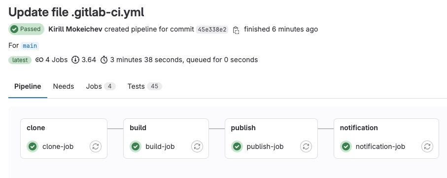
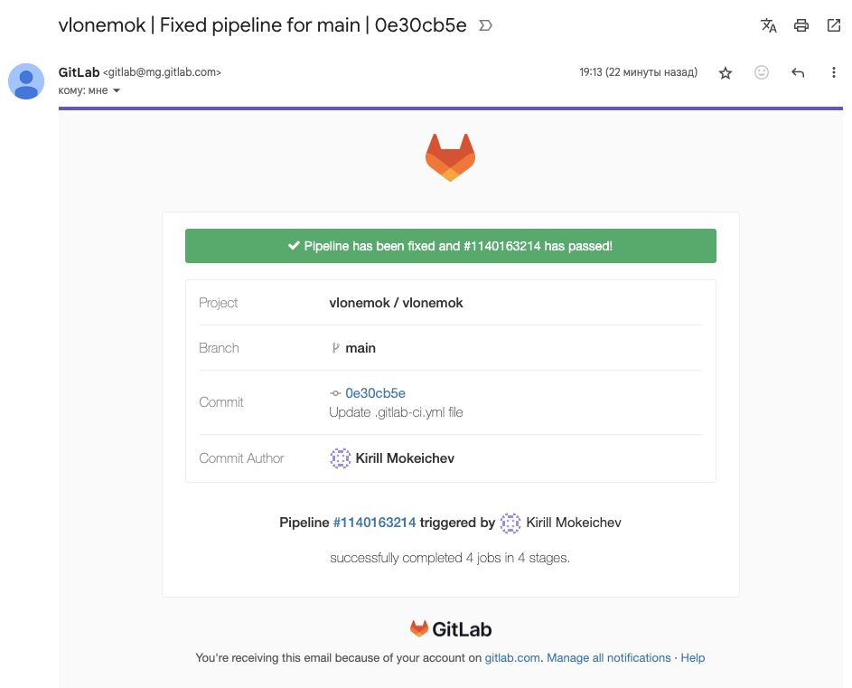

# Homework 28

## 1. Зарегестрироваться на любой облачной CI платформе (например BitBucket, GitLab, GitHub)

```text
Я выбрал GitLab
```



## 2. Реализовать pipeline для проекта spring-petclinic, который состоит из следующих этапов (stages)

[Весь код pipeline на GitLab](gitlab-ci.yml)

```text
Очень удобно использовать GitLab тем, что не обязательно настраивать своих runner (agent в jenkins)
Просто указав в pipeline первой строчкой образ который хочешь использовать, автоматически используется указанный docker образ для работы GitLab CI/CD
```

- Clone
- Клонируется данный проект. Обратите внимание, что этот репозиторий приватный и для того, чтобы его склонировать нужно использовать какие-то credentials.

```yaml
clone-job:
  stage: clone
  artifacts:
    paths:
      - .
  script:
    - git clone https://$github_token@github.com/tms-dos17-onl/spring-petclinic.git
```

```text
Сверху находится job для клонирования проекта с GitHub
Для использования $github_token необходимо создать свой токен в GitHub и затем добавить его как переменную в GitLab
```

- Build
- Происходит сборка проекта через Maven или Gradle и запускаются юнит-тесты.

```yaml
build-job:
   stage: build
   artifacts:
     paths:
       - .
   script:
    - spring-petclinic/mvnw package -f spring-petclinic/pom.xml
```

```text
Сверху находится job для билда проекта с GitHub
```

- Publish
- Публикуется отчёт тестирования.

```yaml
publish-job:
  stage: publish
  script:
    -ls -la
  artifacts:
    reports:
      junit:
        - spring-petclinic/target/surefire-reports/*.xml
```

```text
Сверху находится job для загрузки отчета о тестировании
```



- Notification
- Отправляется письмо с результатом сборки, тому кто её запустил

```yaml
notification-job:      
  stage: notification 
  script:
    - echo "Оповещение отправляется автоматически на почту пользователя, поэтому его настраивать не нужно"
```

```text
Так как оповещение пользователя настроено автоматически, настраивать его не нужно
```






