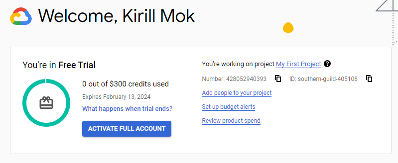
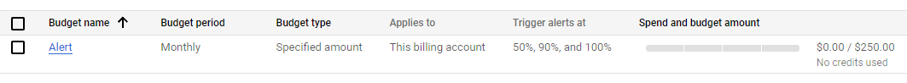
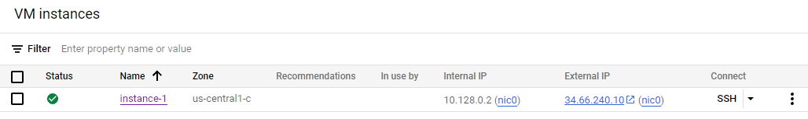
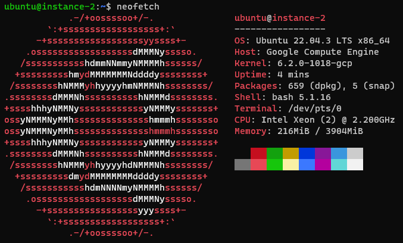
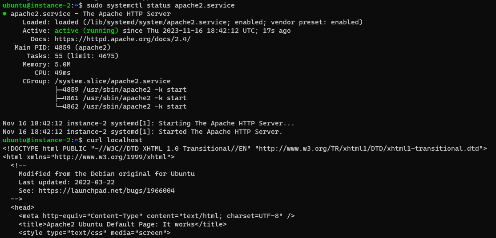
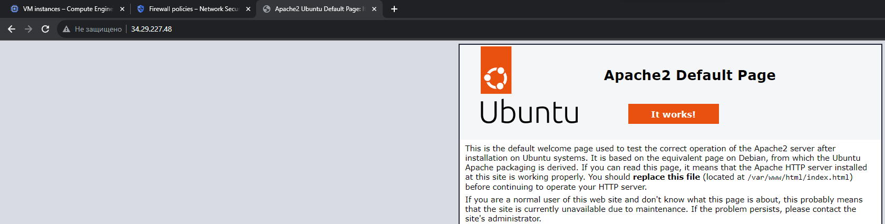

# Homework 29

## 1. Зарегистрироваться на облачном провайдере [Google Cloud Platform (GCP)](https://cloud.google.com/free)

- В качестве локации указать Грузию
- Привязать банковскую карту РБ/РФ
- Получить кредиты от GCP (300$) путем верификации карты

## 2. Настроить предупреждения для бюджета (например, 50$ на месяц)

## 3. Создать свою первую VM в облаке, зайти на неё по SSH и установить Nginx/Apache

**Инстанция в GCP:**

**Инстанция при подключении по SSH**

**Установленный Apache2**

## 4. Создать Firewall правило для подключения к этой VM со своей локальной машины по порту 80. Проверить, что доступ работает

