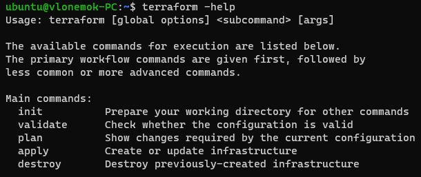
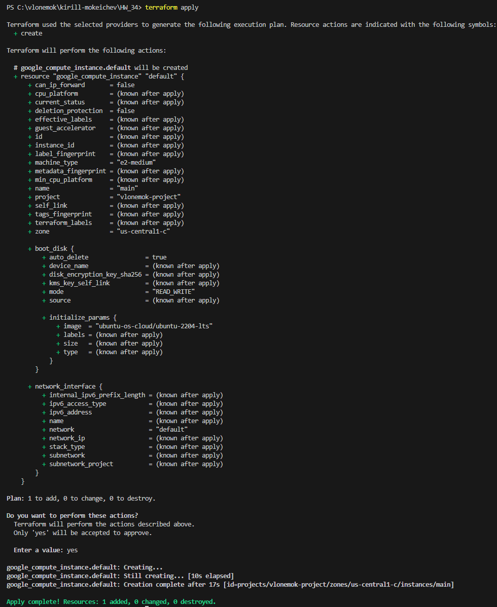
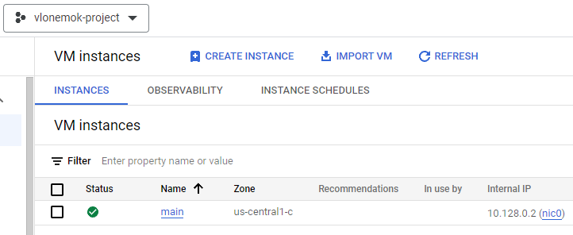
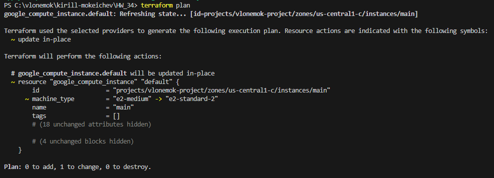

# Homework 34

## 1. Установить Terraform

### Установка на Ubuntu 22.04

```bash
sudo apt-get update && sudo apt-get install -y gnupg software-properties-common

wget -O- https://apt.releases.hashicorp.com/gpg | \
gpg --dearmor | \
sudo tee /usr/share/keyrings/hashicorp-archive-keyring.gpg

gpg --no-default-keyring \
--keyring /usr/share/keyrings/hashicorp-archive-keyring.gpg \
--fingerprint

echo "deb [signed-by=/usr/share/keyrings/hashicorp-archive-keyring.gpg] \
https://apt.releases.hashicorp.com $(lsb_release -cs) main" | \
sudo tee /etc/apt/sources.list.d/hashicorp.list

sudo apt update
sudo apt-get install terraform
```



### Установка на Windows 11 с использованием Chocolatey

```shell
choco install terraform
```

## 2. Написать шаблон для создания виртуальной машины в облаке

[Шаблон](main.tf) для создания виртуальной машины

## 3. Познакомиться с командами

- ```terraform init```

```text
Инициализирует рабочую директорию с файлами конфигурации для правильной работы Terraform
```

- ```terraform fmt```

```text
Используется для того, чтобы перезаписать файл .tf в соответствии с правильной валидацией для языка Terraform
```

- ```terraform validate```

```text
Команда проверяет валидность написанных файлов для Terraform
```

- ```terraform plan```

```text
Данная команда создает план, по которому пользователь может понять, что будет происходит с его инфраструктурой
Например добавит новую виртуальную машину, изменит существующую или удалит ее
```

- ```terraform apply```

```text
Выполняет действия описанные в команде terraform plan
```

- ```terraform destroy```

```text
Удаляет все объекты в инфраструктуре, которые были созданы с помощью конфигурации
```

## 4. Создать виртуальную машину в облаке при помощи ранее созданного шаблона

```bash
terraform apply
```





## 5. Поменять тип виртуальной машины (увеличить количество ресурсов) через веб консоль и выполнить ```terraform plan```. Что предлагает сделать Terraform?


