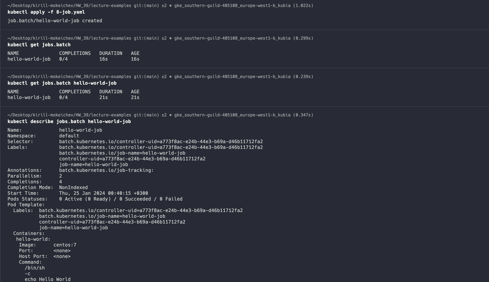

# Homework 39

## 1. Прочитать 2-ю главу [Kubernetes in Action](https://github.com/tms-dos17-onl/_sandbox/blob/main/lecture44/kubernetes-in-action.pdf) и повторить приведенные там примеры

```text
Прочитал первую и вторую главу
Ниже прикрепил скрины примеров из книги
```

### 1 пример (Запуск контейнера с образом busybox)


### 2 пример (создание приложения на NodeJS, написание Dockerfile для него и запуск в Docker)

[app.js приложения из второго примера](book-example/node-js-app/app.js)
[Dockerfile второго примера](book-example/node-js-app/Dockerfile)


### 3 пример (создание кластера в GKE)


### 4 пример (деплой приложения в кластер GKE через cli)


## 2. Познакомиться с Workload объектами Kubernetes (Pod, ReplicaSet, DaemonSet, Job, CronJob), а также их конфигурацией (Liveness Probe, Resources) путем запуска примеров из [lecture45](https://github.com/tms-dos17-onl/_sandbox/tree/main/lecture45)

### [1-pod.yaml](lecture-examples/1-pod.yaml)


### [2-namespace.yaml](lecture-examples/2-namespace.yaml)


### [3-replicaset.yaml](lecture-examples/3-replicaset.yaml)


### [4-livenessprobe.yaml](lecture-examples/4-livenessprobe.yaml)


### [5-resources.yaml](lecture-examples/5-resources.yaml)


### [6-resourcequota.yaml](lecture-examples/6-resourcequota.yaml)

```text
Удалил квоту, чтобы не удалять поды постоянно, а то демонсет не стартовал из-за ограничений
У самого гугла квота на поды 1500 я заметил
```


### [7-daemonset.yanl](lecture-examples/7-daemonset.yaml)


### [8-job.yaml](lecture-examples/8-job.yaml)



### [9-cronjob.yaml](lecture-examples/9-cronjob.yaml)


### Ниже прикрепил скриншот всех подов и их статусы после запущенных примеров


