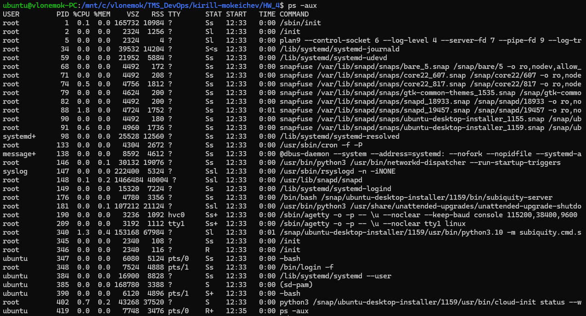
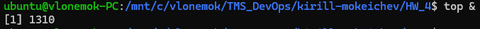
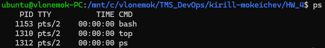
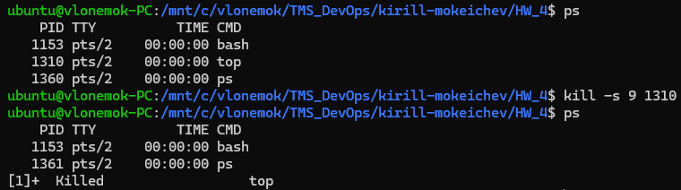
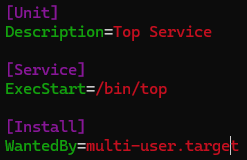
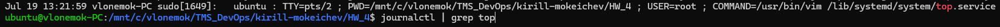
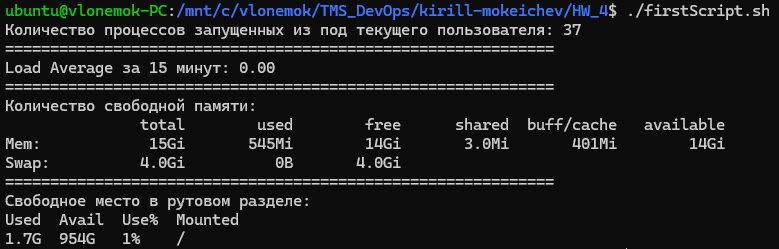
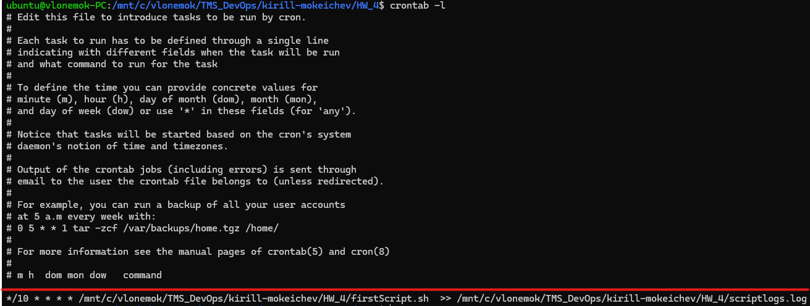

# Homework 4

## 1. Отобразить все процессы в системе

Для того, чтобы отобразить все процессы в системе можно использовать следуюую команду:

```bash
ps -aux
```

Ключ ```-aux``` используется для того, чтобы отобразить все текущие процессы в системе, включая фоновые.

Результат работы команды:



## 2. Запустить бесконечный процесс в фоновом режиме

Для запуска процесса в фоновом режиме необходимо в конце команды добавить амперсанд (&), например:

```bash
top &
```



Так же можно отправить любой процесс в фон используя комбинацию клавиш ```CTRL + Z```

## 3. Убедиться, что процесс продолжил работу после завершения сессии

Убедиться в работоспособности процесса после завершения сессии мы можем используя команду ```ps```:



## 4. Убить процесс, запущенный в фоновом режиме

Убить процесс можно разными способами. Используя утилиты top, htop и тд. Так же можно убить используя команду ```kill```:

```bash
kill -s 9 top
```

Ключ с параметром ```-s 9``` используется для того, чтобы отправить определенный сигнал завершения процессу



## 5. Написать свой сервис под управлением systemd, добавить его в автозагрузку (можно использовать процесс из п.2)

```bash
sudo vim /lib/systemd/system/top.service
```



Данный файл необходимо описать в ```/lib/systemd/system```. После этого данный сервис необходимо запустить:

```bash
sudo systemctl start top
sudo systemctl enable top
```

Проверить состояние процесса можно командой:

```bash
sudo systemctl status <process_name>
```

## 6. Посмотреть логи своего сервиса

Для просмотра логов сервиса можно использовать команду:

```bash
journalctl | grep <service_name>
```



## 7. Написать скрипт, который выводит следующую информацию (можно переиспользовать предыдущее дз)

* *кол-во процессов запущенных из под текущего пользователя*
* *load average за 15 минут*
* *кол-во свободной памяти*
* *свободное место в рутовом разделе “/”*

Здесь можно посмотреть [код скрипта](firstScript.sh). Ниже работа данного скрипта:



## 8. Добавить в cron задачу, которая будет каждые 10 минут писать в файл результаты выполнения скрипта из п.7

Для редактирования и добавления новых задач в ```cron``` необходимо использовать команду:

```bash
crontab -e
```

Для просмотра задач использовать команду:

```bash
crontab -l
```


