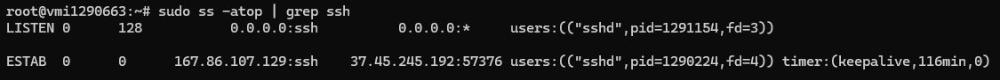
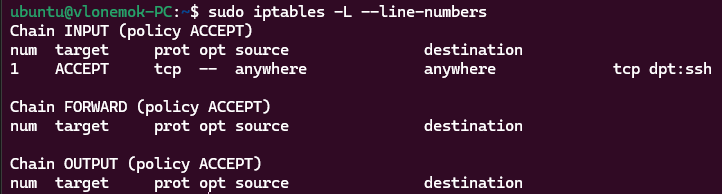

# Homework 5

## 1. Распределить основные сетевые протоколы по уровням модели TCP/IP

**Application level:**

- FTP
- RTP
- DNS
- HTTP
- NTP
- SSH

**Transport level:**

- UDP
- TCP

**Internet level:**

- ICMP

## 2. Узнать pid процесса и длительность подключения ssh с помощью утилиты ss

```bash
sudo ss -atop | grep ssh
```



## 3. Закрыть все порты для входящих подключений, кроме ssh

```bash
sudo iptables -A INPUT -p tcp --dport 22 -j ACCEPT
```



## 4. Установить telnetd на ВМ, зайти на нее с другой ВМ с помощью telnet и отловить вводимый пароль и вводимые команды при входе c помощью tcpdump

```bash
sudo apt install -y telnetd
sudo tcpdump tcp port 22 -s 0 -w test.txt
sudo telnet 172.31.4.39 ---> в моем случае
```

Команда tcpdump должна отловить пакеты отправленные с одной вм на другую и записать в файл test.txt
