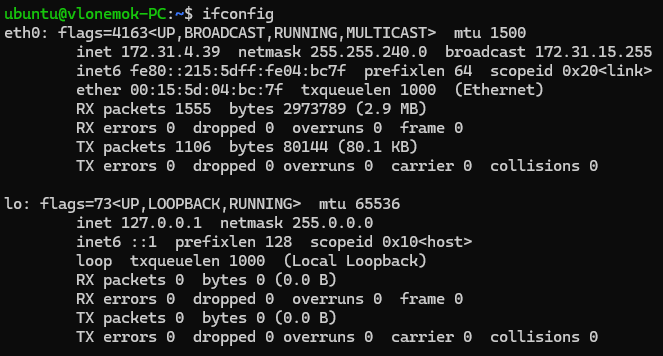
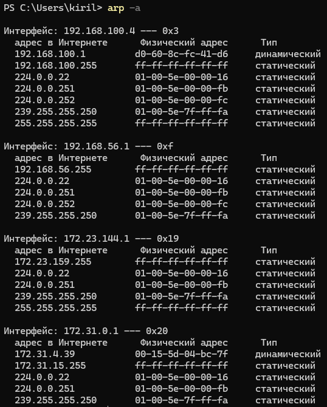
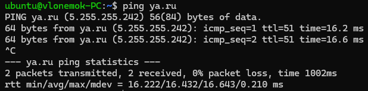

# Homework 6

## 1. Определить все IP адреса, маски подсетей и соответствующие MAC адреса Linux VM. Определите класс и адреса подсетей, в которых находится VM

Для просмотра IP адреса, маски и MAC адреса Linux VM используется команда ```ifconfig``` или ```ip a```:



В моем случае:
IP адрес: **172.31.4.39**; маска подсети: **255.255.240.0**; MAC адрес: **00:15:5d:04:bc:7f**
Класс подсети: **B**
Адрес подсети: **172.31.0.0/20**
Адреса подсетей: **172.31.0.1** - **172.31.15.254**

## 2. Определить публичный IP адрес хоста и Linux VM? Чем они отличаются?

Для определение публичного IP адреса можно сделать ```curl``` адреса ```ifconfig.me```:


Мы можем увидеть, что публичные адреса на VM и на хосте одинаковые. Я использую WSL как VM, а она автоматически использует сеть хоста для выхода в интернет, поэтому у нее такая же публичнаяя сеть

## 3. Вывести ARP таблицу на хосте и найти там запись, соответствующую MAC адресу с предыдущего задания. Если её нет, то объяснить почему

Для вывода ARP таблицы на Windows 11 можно использовать команду ```arp -a```



Как видно на скриншоте, в интерфейсе ```172.31.0.1 --- 0x20``` присутствует запись соответствующая MAC адресу VM

## 4. Выполнить разбиение сети 172.20.0.0/16 на подсети с маской /24 и ответить на следующие вопросы

- Сколько всего подсетей будет в сети? **256**

- Сколько узлов будет в каждой подсети? **254**

- Каким будет сетевой адрес первой и второй подсети? **172.20.0.0** - **172.20.1.0**

- Каким будут адреса первого и последнего хостов в первой и второй подсетях? **172.20.0.1**, **172.20.0.254**, **172.20.1.1**, **172.20.1.254**

- Каким будет широковещательный адрес в последней подсети? **172.20.255.255**

## 5. Найти IP адрес соответствующий доменному имени ya.ru. Выполнить HTTP запрос на указазнный IP адрес, чтобы скачать страницу с помощью утилиты curl. В результате должна вывестись HTML страничка в консоль. [Подсказка:](<https://stackoverflow.com/questions/46563730/can-i-access-to-website-using-ip-address>)

Для поиска IP адреса [ya.ru](<ya.ru>) я использовал команду ```ping```



Для выгрузки странички сайта в консоль служит команда ```curl```. Я перенаправил вывод в [этот файл](curlYandex), чтобы сохранить результат выполнения команды

```bash
curl 5.255.255.242 -LvH 'Host: ya.ru' >> curlYandex
```
