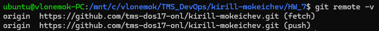
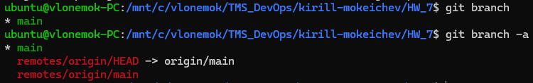
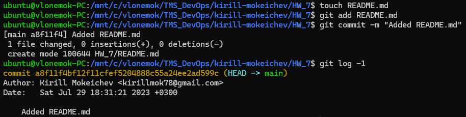
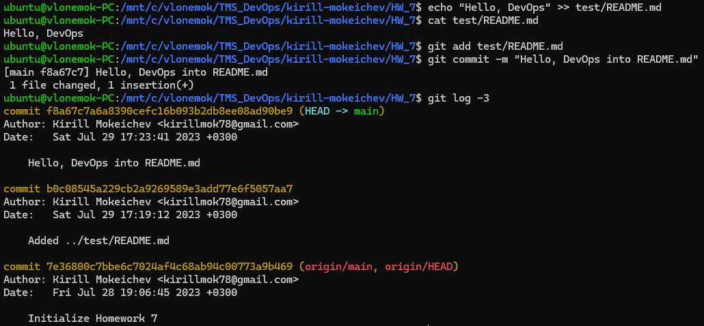
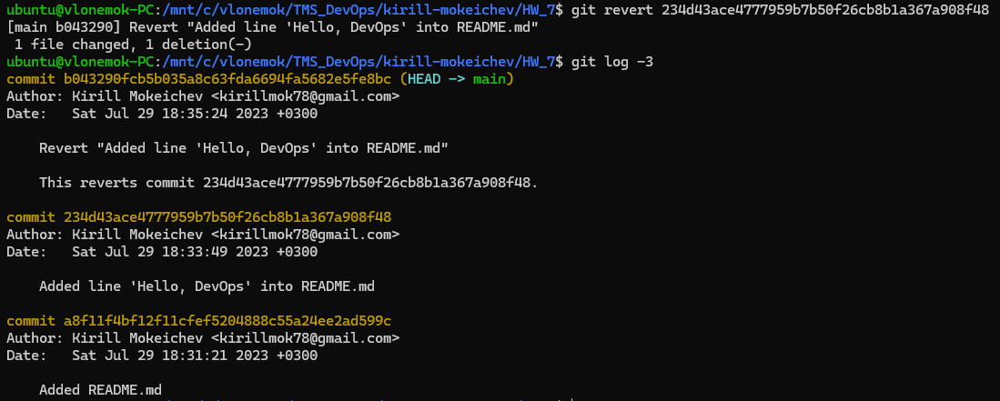

# Homework 7

## 1. Вывести список всех удаленных репозиториев для локального

```bash
git remote -v
```



## 2. Вывести список всех веток

```bash
git branch -a
```



## 3. Вывести последниe 3 коммитa с помощью ```git log```

```bash
git log -3
```


## 4. Создать пустой файл README.md и сделать коммит

---

Я буду выполнять задания не с файлом README.md, а с файлом test.md, потому что у меня возникает конфликт файлов README при ```git revert```, т.к. когда я делаю домашнюю работу, я сразу вношу изменения в файл README.md. Думаю это не играет никакой  роли, ведь суть в том, чтобы попрактиковаться на командах

---

```bash
touch test.md
git add test.md
git commit -m "Added test.md"
```



## 5. Добавить фразу "Hello, DevOps" в README.md файл и сделать коммит

```bash
echo "Hello, DevOps" >> test.md
git add test.md
git commit -m "Hello, DevOps into test.md"
git log -2
```



## 6. Сделать реверт последнего коммита. Вывести последниe 3 коммитa с помощью ```git log```

Что бы я не пытался сделать, у меня не получается сделать ```git revert```. Выдает конфликт постоянно



## 7. Удалить последние 3 коммита с помощью ```git reset```

## 8. Вернуть коммит, где добавляется пустой файл README.md. Для этого найти ID коммита в git reflog, а затем сделать ```cherry-pick```

## 9. Удалить последний коммит с помощью ```git reset```

## 10. Переключиться на ветку main или master. Если ветка называется master, то переименовать её в main

## 11. Скопировать [файл](https://github.com/tms-dos17-onl/_sandbox/blob/main/.github/workflows/validate-shell.yaml), положить его по такому же относительному пути в репозиторий. Создать коммит и запушить его в удаленный репозиторий

## 12. Создать из ветки main ветку develop. Переключиться на неё и создать README.md в корне репозитория. Написать в этом файле какие инструменты DevOps вам знакомы и с какими вы бы хотели познакомиться больше всего (2-3 пункта)

## 13. Создать из ветки main ветку support и создать там файлик LICENSE с содержимым [Apache License](https://www.apache.org/licenses/LICENSE-2.0.txt). Создать коммит. Вывести последниe 3 коммитa

## 14. Переключиться обратно на ветку main и создать там файлик LICENSE с содержимым [Apache License](https://github.com/git/git-scm.com/blob/main/MIT-LICENSE.txt). Создать коммит. Вывести последниe 3 коммитa

## 15. Сделать ```merge``` ветки support в ветку main и решить конфликты путем выбора содержимого только одной лицензии

## 16. Переключиться на ветку develop и сделать ```rebase``` относительно ветки main

## 17. Вывести историю последних 10 коммитов в виде графа с помощью команды ```git log -10 --oneline --graph```

## 18. Запушить ветку develop. В истории коммитов должен быть мерж support -> main

## 19. Зайти в свой репозиторий на GitHub и создать Pull Request из ветки develop в ветку main
