# Homework 7

## 1. Вывести список всех удаленных репозиториев для локального

```bash
git remote -v
```

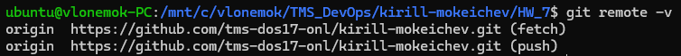

## 2. Вывести список всех веток

```bash
git branch -a
```


## 3. Вывести последниe 3 коммитa с помощью ```git log```

```bash
git log -3
```

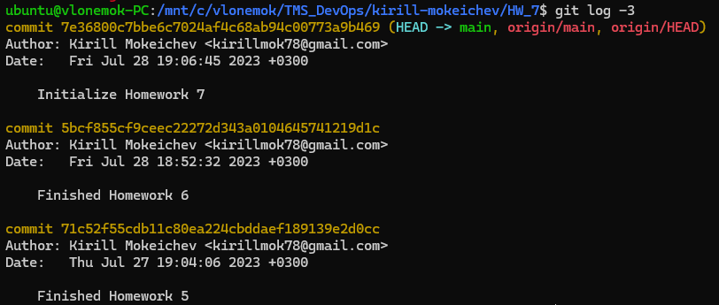

## 4. Создать пустой файл README.md и сделать коммит

```bash
touch README.md
git add README.md
git commit -m "Added README.md"
```


## 5. Добавить фразу "Hello, DevOps" в README.md файл и сделать коммит

```bash
echo "Hello, DevOps" >> README.md
git add README.md
git commit -m "Added line 'Hello, DevOps' into README.md"
```

## 6. Сделать реверт последнего коммита. Вывести последниe 3 коммитa с помощью ```git log```

```bash
git revert 234d43ace4777959b7b50f26cb8b1a367a908f48
git log -3
```


## 7. Удалить последние 3 коммита с помощью ```git reset```

```bash
git reset --hard HEAD~3
```

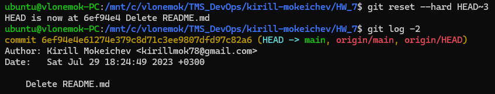

## 8. Вернуть коммит, где добавляется пустой файл README.md. Для этого найти ID коммита в git reflog, а затем сделать ```cherry-pick```

```bash
git reflog
git cherry-pick a8f11f4
```


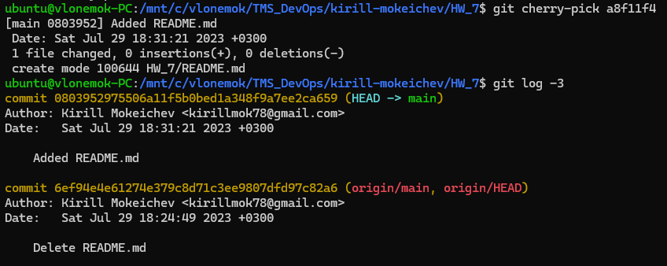

## 9. Удалить последний коммит с помощью ```git reset```

```bash
git reset --hard HEAD~1
```

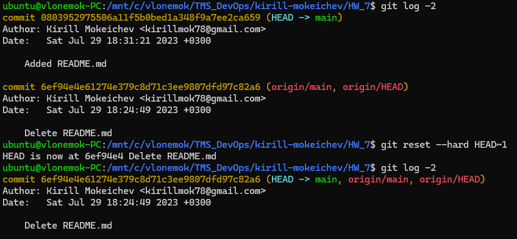

## 10. Переключиться на ветку main или master. Если ветка называется master, то переименовать её в main

```bash
git checkout main
```

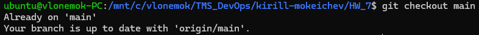

## 11. Скопировать [файл](https://github.com/tms-dos17-onl/_sandbox/blob/main/.github/workflows/validate-shell.yaml), положить его по такому же относительному пути в репозиторий. Создать коммит и запушить его в удаленный репозиторий

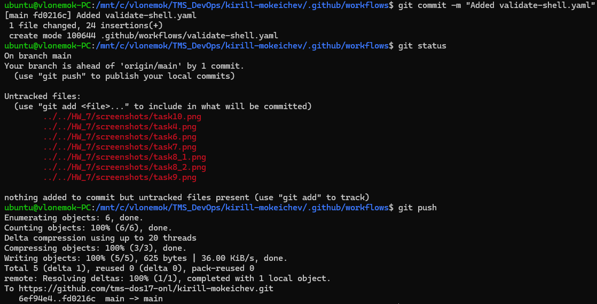

## 12. Создать из ветки main ветку develop. Переключиться на неё и создать README.md в корне репозитория. Написать в этом файле какие инструменты DevOps вам знакомы и с какими вы бы хотели познакомиться больше всего (2-3 пункта)

```bash
git branch develop
git checkout develop
git touch README.md
git add README.md
git commit -m "Added README.md in new branch 'develop'"
```

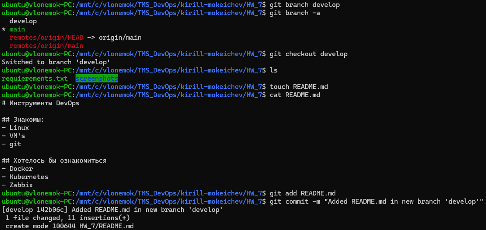

## 13. Создать из ветки main ветку support и создать там файлик LICENSE с содержимым [Apache License](https://www.apache.org/licenses/LICENSE-2.0.txt). Создать коммит. Вывести последниe 3 коммитa

```bash
git branch support
git checkout support
curl https://www.apache.org/licenses/LICENSE-2.0.txt > LICENSE
git add LICENSE
git commit -m "Added LICENSE file on branch 'support'"
git log -3
```

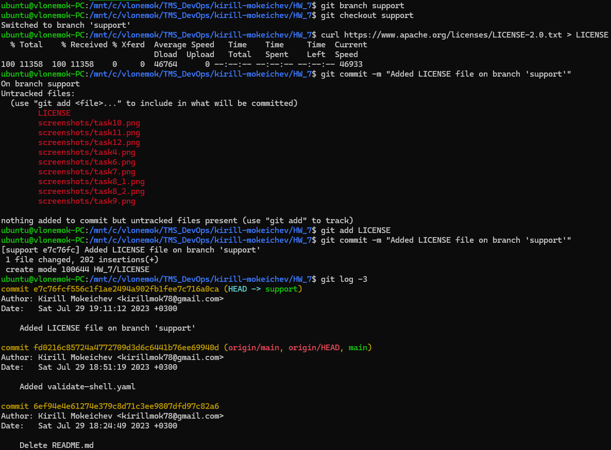

## 14. Переключиться обратно на ветку main и создать там файлик LICENSE с содержимым [Apache License](https://github.com/git/git-scm.com/blob/main/MIT-LICENSE.txt). Создать коммит. Вывести последниe 3 коммитa

```bash
git checkout main
curl https://github.com/git/git-scm.com/blob/main/MIT-LICENSE.txt > LICENSE
git add LICENSE
git commit -m "Added LICENSE file on branch 'main'"
git log -3
```

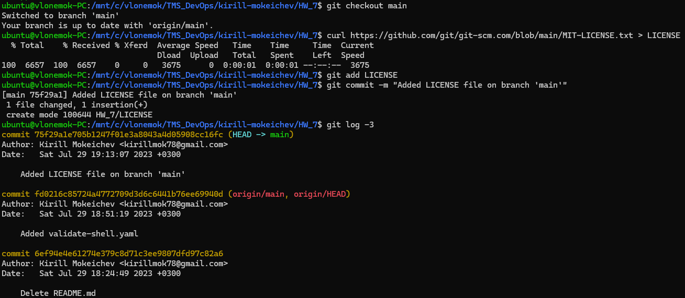

## 15. Сделать ```merge``` ветки support в ветку main и решить конфликты путем выбора содержимого только одной лицензии

```bash
git checkout main
git merge support
mergetool
git commit
```

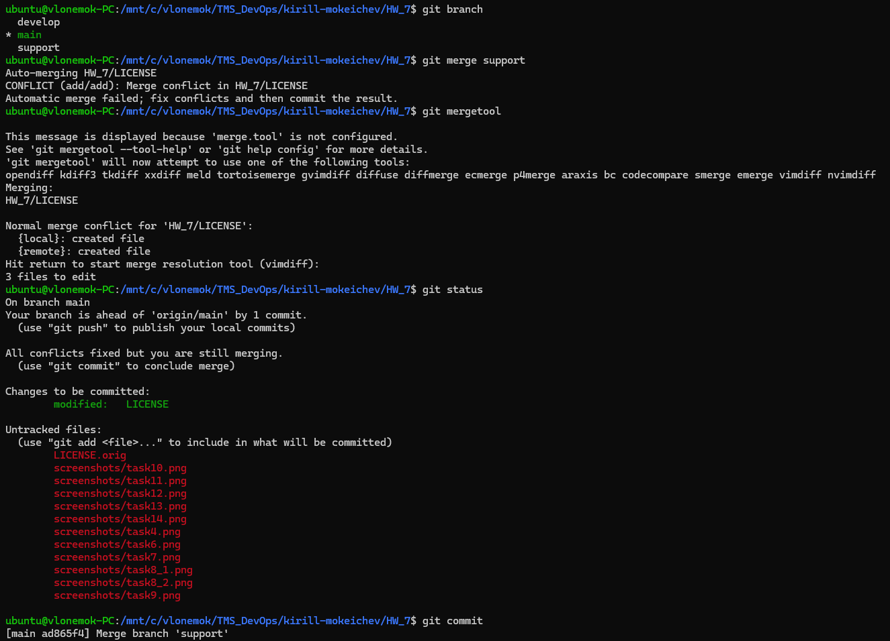

## 16. Переключиться на ветку develop и сделать ```rebase``` относительно ветки main

```bash
git checkout develop
git rebase main
```

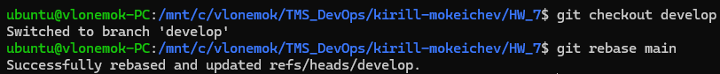

## 17. Вывести историю последних 10 коммитов в виде графа с помощью команды ```git log -10 --oneline --graph```

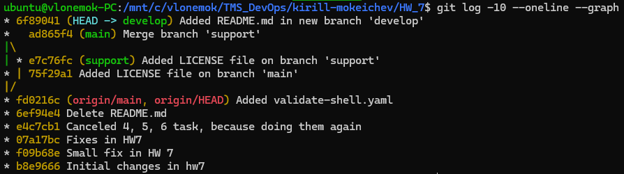

## 18. Запушить ветку develop. В истории коммитов должен быть мерж support -> main

```bash
git checkout develop
git push origin develop
```

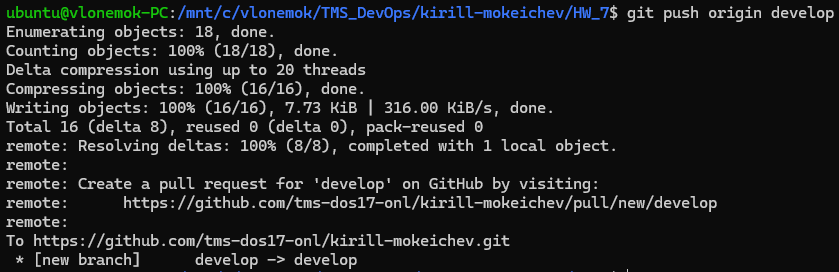

## 19. Зайти в свой репозиторий на GitHub и создать Pull Request из ветки develop в ветку main

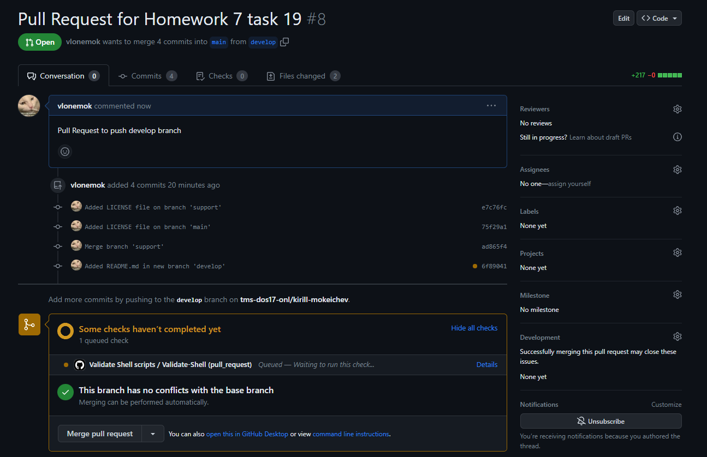
