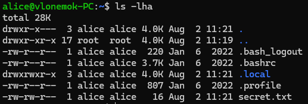
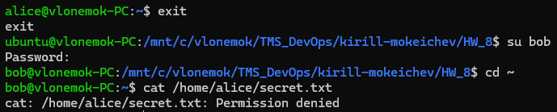

# Homework 8

## 1. Вывести в консоль список всех пользователей системы

```bash
cat /etc/passwd
```

В файле ```/etc/passwd``` находится информация о всех пользователях


## 2. Найти и вывести в консоль домашние каталоги для текущего пользователя и root

```bash
echo $HOME
```

В переменной ```$HOME``` находятся данные о домашней директории текущего пользователя


## 3. Создать Bash скрипт get-date.sh, выводящий текущую дату

Код [скрипта](get-date.sh):

```bash
#!/bin/bash

echo -n "Current date is: "
date
```


## 4. Запустить скрипт через ./get-date.sh и bash get-date.sh. Какой вариант не работает? Сделать так, чтобы оба варианта работали

```bash
bash get-date.sh
# chmod +x get-date.sh
./get-date.sh
```

Если не работает ```./get-date.sh```, необходимо использовать закомментированную команду. Я создавал скрипт через VS Code, и у меня права на выполнение накинулись сразу


## 5. Создать пользователей alice и bob с домашними директориями и установить /bin/bash в качестве командной оболочки по умолчанию

```bash
sudo useradd -m -s /bin/bash alice
sudo passwd alice
sudo useradd -m -s /bin/bash bob
sudo passwd bob
```

Команда ```useradd``` добавляет пользователя. Команда ```passwd``` позволяет установить пароль пользователя

Флаг ```-m``` указывает на создание директории ```/home/alice```, ```/home/bob```

Флаг ```-s``` указывает на создание пользователя с определенным Shell, в нашем случае ```/bin/bash```


## 6. Запустить интерактивную сессию от пользователя alice. Создать файл secret.txt с каким-нибудь секретом в домашней директории при помощи текстового редактора nano

```bash
su alice
cd ~
nano secret.txt
```

```su alice``` используется для того, чтобы запустить интерактивную сессию пользователя alice

```cd ~``` переход в домашнюю директорию пользователя alice

```nano secret.txt``` создание файла secret.txt используя текстовый редактор ```nano```


## 7. Вывести права доступа к файлу secret.txt

```bash
ls -lha
```

Выводит данные о всех файлах в директории. У файла ```secret.txt``` права доступа ```-rw-rw-r--```, что означает запись и чтение для пользователя и группы, а для остальных только чтение.



## 8. Выйти из сессии от alice и открыть сессию от bob. Вывести содержимое файла /home/alice/secret.txt созданного ранее не прибегая к команде sudo. В случае, если это не работает, объяснить

```bash
exit # Выход из сессии alice
sudo su bob
cat /home/alice/secret.txt
```



Пользователь ```bob``` не может прочитать файл ```secret.txt``` в ```/home/alice```, так как он не имеет доступа к домашнему каталогу пользователя ```alice```

## 9. Создать файл secret.txt с каким-нибудь секретом в каталоге /tmp при помощи текстового редактора nano

```bash
cd /tmp
nano secret.txt
```


## 10. Вывести права доступа к файлу secret.txt. Поменять права таким образом, чтобы этот файл могли читать только владелец и члены группы, привязанной к файлу

```bash
ls -lha
chmod o-r secret.txt # Снятие прав на чтение у "других"
chmod ug-w secret.txt # Снятие прав у пользователя и группы на запись
```


## 11. Выйти из сессии от bob и открыть сессию от alice. Вывести содержимое файла /tmp/secret.txt созданного ранее не прибегая к команде sudo


## 12. Добавить пользователя alice в группу, привязанную к файлу /tmp/secret.txt

```bash
sudo usermod -a -G bob alice
```


## 13. Вывести содержимое файла /tmp/secret.txt


## 14. Скопировать домашнюю директорию пользователя alice в директорию /tmp/alice с помощью rsync

```bash
rsync -av /home/alice /tmp/
```


## 15. Скопировать домашнюю директорию пользователя alice в директорию /tmp/alice на другую VM по SSH с помощью rsync. Как альтернатива, можно скопировать любую папку с хоста на VM по SSH

```bash
rsync -avz /tmp/alice ubuntu@172.31.4.39:/tmp/alice
```


## 16. Удалить пользователей alice и bob вместе с домашними директориями

```bash
sudo deluser --remove-home alice
sudo deluser --remove-home bob
```

Данные команды удаляют пользователей ```bob``` и ```alice``` вместе с домашними директориями


## 17. С помощью утилиты htop определить какой процесс потребляет больше всего ресурсов в системе


## 18. Вывести логи сервиса Firewall с помощью journalctl не прибегая к фильтрации с помощью grep

```bash
journalctl -u firewalld
```


