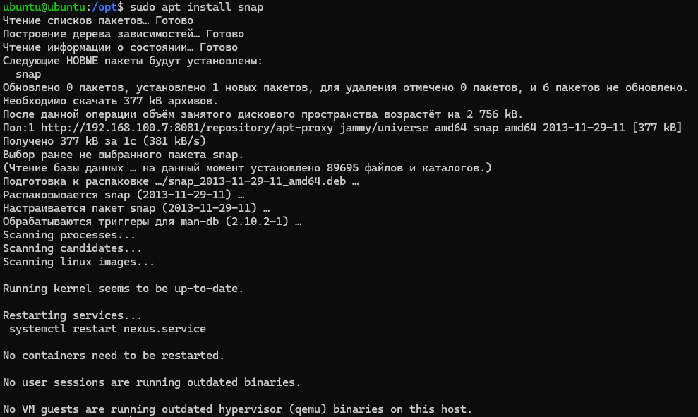
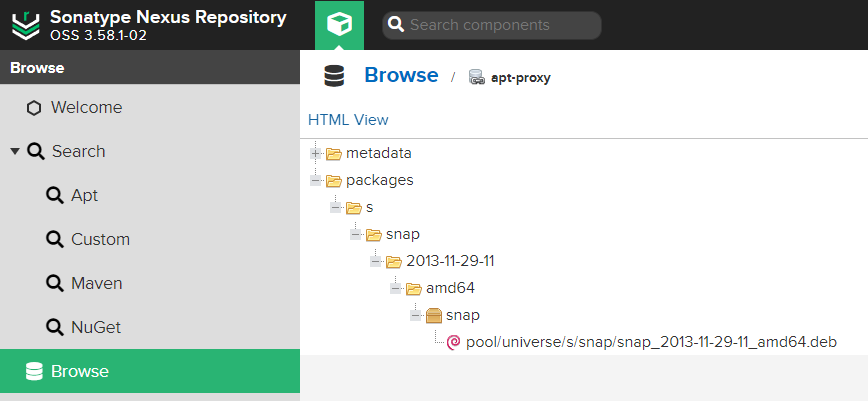

# Homework 9

## 1. Добавить новый диск к виртуальной машине и проверить, что система видит его


```sda``` - это первичный раздел. ```sdb``` - наш новый раздел

## 2. Вывести в консоль информацию по текущему размеру файловой системы


## 3. Расширить корневую файловую систему за счёт добавленного диска

Команды ниже я использовал для того, чтобы расширить корневую файловую систему

```bash
sudo pvcreate /dev/sdb
sudo vgextend ubuntu-vg /dev/sdb
sudo lvextend -l +100%FREE /dev/ubuntu-vg/ubuntu-lv
sudo resize2fs /dev/ubuntu-vg/ubuntu-lv
```

## 4. Вывести информацию по новому размеру файловой системы


## 5. Вывести в консоль текущую рабочую директорию

Для вывода в консоль рабочей директории используется команда ```pwd```

```bash
pwd
```


## 6. Вывести в консоль все файлы из домашней директории

```bash
ls -la $HOME

или

ls-la ~
```

## 7. Построить маршрут до ```google.com``` при помощи утилиты ```traceroute```

```bash
traceroute google.com
```


## 8. Установить ```Sonatype Nexus OSS``` по следующей [инструкции](https://www.fosstechnix.com/how-to-install-nexus-repository-on-ubuntu/), а именно

- установку произвести в директорию ```/opt/nexus```.
- запустить приложение от отдельного пользователя ```nexus```.
- реализовать systemd оболочку для запуска приложения как сервис.

```bash
sudo apt install openjdk-8-jre-headless # Установка Java JDK 8
cd /opt
sudo wget https://download.sonatype.com/nexus/3/latest-unix.tar.gz # Скачивание nexus
sudo tar -zxvf latest-unix.tar.gz # Разархивирование nexus
sudo mv /opt/nexus-3.58.1-02 /opt/nexus # Переименование 
sudo adduser nexus # Добавление пользователя nexus
sudo visudo # Здесь мы даем ему права
sudo chown -R nexus:nexus /opt/nexus
sudo chown -R nexus:nexus /opt/sonatype-work
sudo systemctl start nexus # Запустить сервис nexus
sudo systemctl enable nexus
cat /opt/sonatype-work/nexus3/admin.password # Достать пароль admin
```

Установка происходила полностью по гайду, что ты скинул в условии задания

## 9. Создать в Nexus proxy репозиторий для пакетов ОС и разрешить анонимный доступ


## 10. Поменять для текущей VM основной репозиторий пакетов на созданный ранее proxy в Nexus


## 11. Выполнить установку пакета ```snap``` и убедиться, что на proxy репозитории в Nexus появились пакеты





## 12. (**) На основании шагов из предыдущих пунктов создать DEB/RPM пакет для установки Nexus и загрузить его в Nexus
